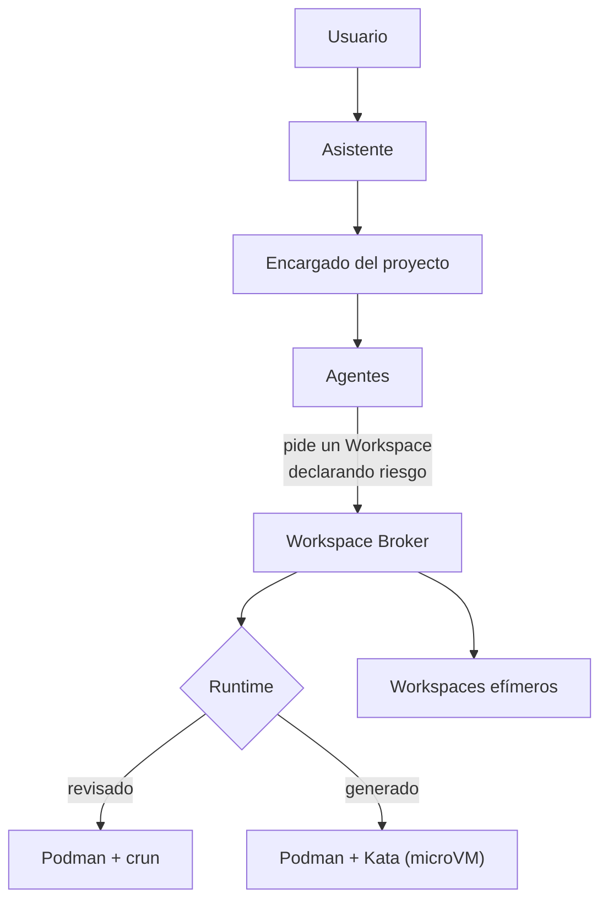

# JAFNE

**Jarvis Assistant For N→ Software Engineering**

JAFNE es un sistema de orquestación de ingeniería de software asistida por IA. No es un
chatbot ni un único agente: coordina múltiples agentes de IA **y** los **entornos de
ejecución** (workspaces efímeros) donde esos agentes diseñan, documentan, construyen,
prueban y despliegan software.

> Antes se llamaba *Engineering OS*. Desde la v0.2 el proyecto es **JAFNE**
> (ver [ADR-0001](docs/adr/0001-rebrand-engineering-os-a-jafne.md)).

## Idea central

Un agente **nunca** prepara sus dependencias a mano ni ejecuta Docker directamente. Le
**pide un Workspace** al sistema de infraestructura y trabaja dentro de él. La tecnología
de virtualización (Docker, Podman, Kubernetes, nodos distribuidos vía ZeroTier) queda
**completamente desacoplada** del comportamiento de los agentes.



El Agente declara **qué tan riesgoso** es lo que va a ejecutar, no qué tecnología quiere:
código revisado corre en contenedor y código recién generado por un modelo corre en
microVM ([ADR-0027](docs/adr/0027-clase-de-riesgo-declarada-por-el-encargado.md),
[ADR-0032](docs/adr/0032-driver-de-la-clase-generado.md)).

## Cómo está organizado este repo

JAFNE se documenta en **dos zonas** con estándares distintos (ver [`WORKFLOW.md`](WORKFLOW.md)):

| Zona | Qué contiene | Estándar |
|---|---|---|
| [`investigacion/`](investigacion/) | Diseño **exploratorio**: opciones, trade-offs y descartes. Es donde vive el brainstorming. | Casa Justina (evolutivo) |
| [`docs/`](docs/) | Lo **congelado**: arquitectura aceptada y decisiones. | ADR + docs técnicas |
| [`src/jafne/`](src/jafne/) | El **código**: núcleo de Asuntos y panel web. | Python + FastAPI ([ADR-0015](docs/adr/0015-stack-inicial-de-implementacion.md)) |

**Regla de graduación:** una investigación *gradúa* a un ADR en [`docs/adr/`](docs/adr/)
cuando la decisión se congela y pasa a restringir el diseño o el código.

### Por dónde entrar

`docs/adr/` es el **historial** del diseño: conserva el *por qué* y los descartes, pero
reconstruir el estado actual leyendo treinta y cuatro decisiones en orden es caro y sale
mal. Para eso hay tres documentos derivados, y son el punto de entrada:

| Querés saber… | Andá a |
|---|---|
| Qué está **decidido** | [`docs/estado-del-diseno.md`](docs/estado-del-diseno.md) |
| Qué de eso ya **corre** | [`docs/estado-de-implementacion.md`](docs/estado-de-implementacion.md) |
| Qué falta **decidir** | `jafne pendientes` |

Es la misma forma que JAFNE usa para un Asunto: `historial.jsonl` es append-only y
completo, `meta.yaml` es chico y actual, y para decidir se lee el segundo.

## Estado

🏗️ **Diseño avanzado, implementación en curso.** Treinta y cuatro ADRs congelados, siete
decisiones abiertas y 159 tests en verde (2026-08-18).

El código arrancó el 2026-08-11 bajo una regla explícita: **lo que no está decidido no se
programa**. Lo que depende de una pregunta abierta existe como interfaz, pero falla
citando qué la bloquea — nunca con un default improvisado. Y desde
[ADR-0028](docs/adr/0028-anthropic-primero-alcance-de-adaptadores.md) hay una segunda
categoría, separada a propósito: lo **decidido y todavía no escrito**, que falla distinto
porque lleva a otra acción.

```bash
python -m venv .venv
.venv/Scripts/pip install -e ".[dev]"    # Linux/macOS: .venv/bin/pip

jafne init                               # crea ~/.jafne/ (ADR-0007)
jafne panel                              # http://127.0.0.1:8730
jafne reloj                              # el trabajo programado, en su propio proceso
jafne cerebros                           # tamaño, adaptador y señal de saldo por proveedor
jafne credencial                         # con qué credencial habla JAFNE
jafne pendientes                         # qué falta decidir, y qué bloquea cada cosa
```

El panel deja **dictar** el mensaje del chat en vez de tipearlo. Corre con Whisper local
—el audio no sale de la máquina ni se guarda— y es un extra opcional:

```bash
.venv/Scripts/pip install -e ".[voz]"    # sin esto el botón aparece deshabilitado
```

### Iniciar sesión

**JAFNE no tiene login, y es a propósito.** El adaptador maneja la CLI de Claude Code y
hereda tu sesión, así que JAFNE nunca pide, guarda ni ve una credencial
([ADR-0034](docs/adr/0034-el-adaptador-usa-la-sesion-de-claude-code.md)). Se configura una
vez, fuera de JAFNE:

```bash
claude          # y adentro: /login
jafne credencial   # confirma que JAFNE lo encuentra
```

Si usás Claude Code desde la extensión del editor, el binario no queda en el `PATH`:
apuntá `JAFNE_CLAUDE_CLI` al ejecutable que ya tenés.

> ⚠️ Si tenés `ANTHROPIC_API_KEY` en el entorno, **pisa tu suscripción** y las llamadas se
> facturan por token. `jafne credencial` te avisa.

### El panel por ZeroTier

El panel se niega a escuchar en todas las interfaces, y fuera de loopback exige token
([ADR-0020](docs/adr/0020-hosting-y-autenticacion-del-panel.md)):

```bash
JAFNE_PANEL_TOKEN=… jafne panel --host <IP-ZeroTier>
```
