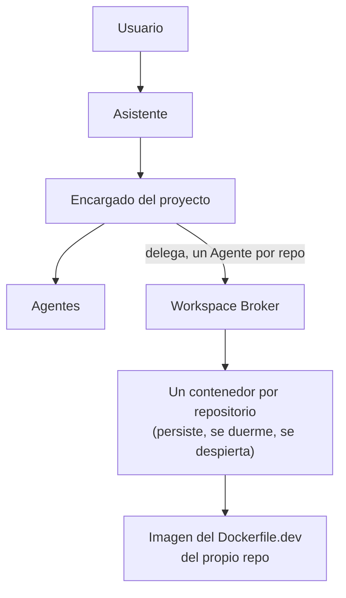

# JAFNE

**Jarvis Assistant For N→ Software Engineering**

JAFNE es un sistema de orquestación de ingeniería de software asistida por IA. No es un
chatbot ni un único agente: coordina múltiples agentes de IA **y** los **entornos de
ejecución** (un contenedor por repositorio) donde esos agentes diseñan, documentan, construyen,
prueban y despliegan software.

> Antes se llamaba *Engineering OS*. Desde la v0.2 el proyecto es **JAFNE**
> (ver [ADR-0001](docs/adr/0001-rebrand-engineering-os-a-jafne.md)).

## Idea central

Un agente **nunca** prepara sus dependencias a mano ni ejecuta Docker directamente. Le
**pide un Workspace** al sistema de infraestructura y trabaja dentro de él. La tecnología
de virtualización (Docker, Podman, Kubernetes, nodos distribuidos vía ZeroTier) queda
**completamente desacoplada** del comportamiento de los agentes.



**Un contenedor por repositorio**, creado al delegar un Agente y no al abrir el Asunto
([ADR-0047](docs/adr/0047-los-contenedores-son-por-repositorio.md)). Persiste mientras haga
falta: se duerme para no gastar cómputo y se despierta cuando hay trabajo.

Los contenedores existen por **dos motivos**: dormir/despertar y portabilidad
([ADR-0045](docs/adr/0045-para-que-existen-los-contenedores.md)). El aislamiento es una
consecuencia, no el motivo — por eso JAFNE ya **no elige runtime** y usa el default de
Podman, que es donde `podman exec` funciona.

El **cerebro corre afuera** del contenedor y la credencial nunca entra
([ADR-0046](docs/adr/0046-el-cerebro-corre-afuera-el-contenedor-ejecuta.md)); adentro solo
se ejecuta. El entorno lo declara **el repo** en su `Dockerfile.dev`
([ADR-0048](docs/adr/0048-el-repo-declara-su-entorno-de-desarrollo.md)).

## Cómo está organizado este repo

JAFNE se documenta en **dos zonas** con estándares distintos (ver [`WORKFLOW.md`](WORKFLOW.md)):

| Zona | Qué contiene | Estándar |
|---|---|---|
| [`investigacion/`](investigacion/) | Diseño **exploratorio**: opciones, trade-offs y descartes. Es donde vive el brainstorming. | Casa Justina (evolutivo) |
| [`docs/`](docs/) | Lo **congelado**: arquitectura aceptada y decisiones. | ADR + docs técnicas |
| [`src/jafne/`](src/jafne/) | El **código**: núcleo de Asuntos y panel web. | Python + FastAPI ([ADR-0015](docs/adr/0015-stack-inicial-de-implementacion.md)) |

**Regla de graduación:** una investigación *gradúa* a un ADR en [`docs/adr/`](docs/adr/)
cuando la decisión se congela y pasa a restringir el diseño o el código.

### Por dónde entrar

`docs/adr/` es el **historial** del diseño: conserva el *por qué* y los descartes, pero
reconstruir el estado actual leyendo cuarenta y cuatro decisiones en orden es caro y sale
mal. Para eso hay tres documentos derivados, y son el punto de entrada:

| Querés saber… | Andá a |
|---|---|
| Qué está **decidido** | [`docs/estado-del-diseno.md`](docs/estado-del-diseno.md) |
| Qué de eso ya **corre** | [`docs/estado-de-implementacion.md`](docs/estado-de-implementacion.md) |
| Qué falta **decidir** | `jafne pendientes` |

Es la misma forma que JAFNE usa para un Asunto: `historial.jsonl` es append-only y
completo, `meta.yaml` es chico y actual, y para decidir se lee el segundo.

## Estado

🏗️ **Diseño avanzado, implementación en curso.** Cincuenta ADRs congelados, seis
decisiones abiertas y 386 tests en verde (2026-08-19).

El código arrancó el 2026-08-11 bajo una regla explícita: **lo que no está decidido no se
programa**. Lo que depende de una pregunta abierta existe como interfaz, pero falla
citando qué la bloquea — nunca con un default improvisado. Y desde
[ADR-0028](docs/adr/0028-anthropic-primero-alcance-de-adaptadores.md) hay una segunda
categoría, separada a propósito: lo **decidido y todavía no escrito**, que falla distinto
porque lleva a otra acción.

```bash
python -m venv .venv
.venv/Scripts/pip install -e ".[dev]"    # Linux/macOS: .venv/bin/pip

jafne init                               # crea ~/.jafne/ (ADR-0007)
jafne panel                              # http://127.0.0.1:8730
jafne reloj                              # el trabajo programado, en su propio proceso
jafne infra                              # Workspaces, saldo y el servidor MCP
jafne cerebros                           # tamaño, adaptador y señal de saldo por proveedor
jafne credencial                         # con qué credencial habla JAFNE
jafne pendientes                         # qué falta decidir, y qué bloquea cada cosa
```

El panel deja **dictar** el mensaje del chat en vez de tipearlo. Corre con Whisper local
—el audio no sale de la máquina ni se guarda— y es un extra opcional:

```bash
.venv/Scripts/pip install -e ".[voz]"    # sin esto el botón aparece deshabilitado
```

Si hay otra máquina en la malla ZeroTier con GPU NVIDIA, el dictado se le puede delegar
([ADR-0037](docs/adr/0037-el-dictado-puede-delegarse-a-un-nodo-con-gpu.md)): ahí corre
`jafne voz` y acá se declara `$JAFNE_VOZ_NODO`. Sin declararlo, transcribe la máquina del
panel.

### Iniciar sesión

**JAFNE no tiene login, y es a propósito.** El adaptador maneja la CLI de Claude Code y
hereda tu sesión, así que JAFNE nunca pide, guarda ni ve una credencial
([ADR-0034](docs/adr/0034-el-adaptador-usa-la-sesion-de-claude-code.md)). Se configura una
vez, fuera de JAFNE:

```bash
claude          # y adentro: /login
jafne credencial   # confirma que JAFNE lo encuentra
```

Si usás Claude Code desde la extensión del editor, el binario no queda en el `PATH`:
apuntá `JAFNE_CLAUDE_CLI` al ejecutable que ya tenés.

> ⚠️ Si tenés `ANTHROPIC_API_KEY` en el entorno, **pisa tu suscripción** y las llamadas se
> facturan por token. `jafne credencial` te avisa.

## Operación

JAFNE son **cuatro procesos independientes**, y esa independencia es una decisión, no un
accidente: el reloj se separó del panel para que cerrar el dashboard no apague el trabajo
programado ([ADR-0035](docs/adr/0035-el-reloj-corre-en-su-propio-proceso.md)), el nodo de
voz vive aparte porque presta una GPU y no observa nada
([ADR-0037](docs/adr/0037-el-dictado-puede-delegarse-a-un-nodo-con-gpu.md)), e
Infraestructura es propia porque es dueña de cosas que **sobreviven al turno que las pidió**
—un contenedor, una microVM, la cuenta del saldo—
([ADR-0042](docs/adr/0042-infraestructura-es-un-proceso-con-el-mcp-adentro.md)).

| Proceso | Dónde corre | Para qué | Si no corre |
|---|---|---|---|
| `jafne panel` | Tu máquina | Dashboard: proyectos, Asuntos, saldo, chat | No hay dashboard. Nada más se detiene |
| `jafne reloj` | Tu máquina | Dispara el trabajo programado por cadencia | No hay Asuntos disparados por tiempo |
| `jafne infra` | Tu máquina | Workspaces, el saldo y el servidor MCP | El agente no ve el estado de los proyectos, no hay Workspaces, y `jafne saldo` falla al registrar |
| `jafne voz` | La máquina con GPU | Transcribe el dictado del panel | El botón de dictado sale deshabilitado, con el motivo |

Ninguno depende de otro para arrancar. El panel, el reloj e Infraestructura comparten
`~/.jafne/`; el nodo de voz **no lo toca**.

Del saldo hay **un solo escritor**: Infraestructura. `jafne saldo` es cliente suyo y falla
diciéndolo si está apagada, en vez de escribir el archivo por atrás
([ADR-0025](docs/adr/0025-presupuesto-por-proveedor-y-conmutacion-por-saldo.md), ADR-0042).

### A mano, para probar

```powershell
cd C:\Repos\jafne

.venv\Scripts\jafne.exe panel                  # http://127.0.0.1:8730
.venv\Scripts\jafne.exe reloj --ver            # qué hay agendado, sin disparar nada
.venv\Scripts\jafne.exe reloj                  # el proceso: espera y dispara
.venv\Scripts\jafne.exe infra                  # http://127.0.0.1:8732
```

Cada uno ocupa su consola. Para dejarlos andando solos, seguí abajo.

### Como servicio en Windows

**No uses `sc create` apuntando a Python.** El gestor de servicios espera que el ejecutable
le conteste, y un `python.exe` cualquiera no lo hace: el servicio arranca y a los 30
segundos Windows lo mata con *"no respondió a tiempo"*. Lo que sí funciona sin instalar
nada de terceros es el **Programador de tareas**.

> Esto no contradice a ADR-0035, que descartó el Task Scheduler para el reloj. Ahí se
> descartaba **declarar las cadencias** en el programador —partiría la configuración en dos
> lugares—; acá se lo usa solo para **arrancar el proceso**. Las cadencias siguen viviendo
> enteras en `~/.jafne/programado.yaml`.

Primero el token del panel, como variable de máquina y una sola vez (**PowerShell como
administrador**):

```powershell
$token = -join ((48..57) + (65..90) + (97..122) | Get-Random -Count 32 | ForEach-Object {[char]$_})
[Environment]::SetEnvironmentVariable("JAFNE_PANEL_TOKEN", $token, "Machine")
$token    # anotalo: te hace falta para entrar desde otra máquina
```

Después las dos tareas. El `-User $env:USERNAME` importa: el almacén es
`C:\Users\<vos>\.jafne`, así que corriendo como `SYSTEM` JAFNE miraría otro directorio y no
vería ninguno de tus Asuntos.

```powershell
$jafne = "C:\Repos\jafne\.venv\Scripts\jafne.exe"
$sinLimite = New-ScheduledTaskSettingsSet -RestartCount 3 -RestartInterval (New-TimeSpan -Minutes 1) -ExecutionTimeLimit ([TimeSpan]::Zero)

# El reloj: al arrancar la máquina, aunque no hayas iniciado sesión.
Register-ScheduledTask -TaskName "JAFNE reloj" `
  -Action (New-ScheduledTaskAction -Execute $jafne -Argument "reloj") `
  -Trigger (New-ScheduledTaskTrigger -AtStartup) `
  -Settings $sinLimite -RunLevel Limited `
  -User $env:USERNAME -Password (Read-Host "Contraseña de Windows")

# El panel: al iniciar sesión, que es cuando lo vas a mirar.
Register-ScheduledTask -TaskName "JAFNE panel" `
  -Action (New-ScheduledTaskAction -Execute $jafne -Argument "panel --host 10.144.0.1") `
  -Trigger (New-ScheduledTaskTrigger -AtLogOn -User $env:USERNAME) `
  -Settings $sinLimite -User $env:USERNAME
```

`-ExecutionTimeLimit ([TimeSpan]::Zero)` no es opcional: el default del programador mata la
tarea a las 72 horas, y estos procesos no terminan nunca por diseño.

El reloj pide contraseña porque corre **sin sesión iniciada** — es lo que hace que una
cadencia del domingo a las 3 AM se dispare de verdad. Si preferís no guardarla, cambiale el
disparador a `-AtLogOn` y aceptá que solo corre cuando estás logueado.

Comprobar, arrancar y dar de baja:

```powershell
Get-ScheduledTask -TaskName "JAFNE *" | Get-ScheduledTaskInfo   # última corrida y resultado
Start-ScheduledTask -TaskName "JAFNE reloj"
Stop-ScheduledTask  -TaskName "JAFNE reloj"
Unregister-ScheduledTask -TaskName "JAFNE reloj" -Confirm:$false
```

Como la tarea corre sin consola, la salida del reloj no se ve en ningún lado. Para saber
qué hizo, mirá los Asuntos que abrió: `jafne asuntos`.

### El panel por ZeroTier

El panel se niega a escuchar en todas las interfaces, y fuera de loopback exige token
([ADR-0020](docs/adr/0020-hosting-y-autenticacion-del-panel.md)). Con el token ya puesto
como variable de máquina:

```powershell
.venv\Scripts\jafne.exe panel --host 10.144.0.1
```

Windows además tiene que dejar entrar la conexión. La interfaz de ZeroTier suele quedar
catalogada como **Public** —el perfil más cerrado—, así que la regla va con `-Profile Any`
y no depende de eso (**PowerShell como administrador**):

```powershell
New-NetFirewallRule -DisplayName "JAFNE panel (ZeroTier)" `
  -Direction Inbound -Action Allow -Protocol TCP -LocalPort 8730 `
  -Profile Any -RemoteAddress 10.144.0.0/16
```

El `-RemoteAddress` acota la regla a la malla: aunque te conectes al WiFi de un aeropuerto,
el puerto no queda abierto para la red del lugar.

Desde otra máquina de la malla, la primera visita lleva el token en la URL y después queda
en una cookie:

```
http://10.144.0.1:8730/?token=<tu-token>
```

> **Para dictar desde otra máquina hace falta HTTPS** — el navegador no entrega el
> micrófono a un origen inseguro. Está resuelto: ver la sección siguiente.

### HTTPS, y por qué hace falta

Sin HTTPS el dashboard se ve bien desde toda la malla, pero **el micrófono no funciona**
desde ninguna máquina que no sea la propia. No es un problema de JAFNE ni de ZeroTier: los
navegadores solo entregan el micrófono a un *contexto seguro* —HTTPS, o `localhost`—, y
`http://10.144.0.1:8730` no lo es.

Conviene descartar de entrada la solución que parece obvia y no sirve: **mover el panel a
la máquina con GPU tampoco arregla esto**. La regla mira el origen que carga el navegador,
no dónde está el servidor; desde un tercer nodo, `http://10.144.0.2:8730` es igual de
inseguro. Por eso [ADR-0038](docs/adr/0038-tls-del-panel-con-ca-propia.md) decidió TLS —y
dejó escrito que el motivo es **desbloquear el micrófono**, no agregar confidencialidad,
que la malla ya da—.

El certificado sale de una **CA propia** con `mkcert`: las IPs de la malla son privadas, así
que una autoridad pública exigiría un dominio y un desafío DNS-01, para una red que es tuya.

En tu máquina, una vez:

```powershell
scoop install mkcert          # o: choco install mkcert

mkcert -install               # crea la CA y la instala en tu almacén de confianza
mkcert -CAROOT                # dónde quedó la raíz; te hace falta para los otros dispositivos

mkdir "$env:USERPROFILE\.jafne-tls"
Set-Location "$env:USERPROFILE\.jafne-tls"
mkcert -cert-file panel.crt -key-file panel.key 10.144.0.1 10.144.0.2 10.144.0.3 10.144.0.4 127.0.0.1 localhost
```

Listá **todas** las IPs de la malla que vayan a servir algo: un nodo que se suma después
obliga a reemitir el certificado.

Y para que el panel lo use:

```powershell
[Environment]::SetEnvironmentVariable("JAFNE_PANEL_CERT",  "$env:USERPROFILE\.jafne-tls\panel.crt", "Machine")
[Environment]::SetEnvironmentVariable("JAFNE_PANEL_CLAVE", "$env:USERPROFILE\.jafne-tls\panel.key", "Machine")

.venv\Scripts\jafne.exe panel --host 10.144.0.1
```

Ahora anuncia `https://…` al arrancar. Sin certificado sigue sirviendo HTTP —que por la
malla ya va cifrado— pero **avisa en la consola** que el micrófono remoto no va a andar, en
vez de dejarte descubrirlo con un botón gris.

Comprobalo desde la propia máquina, sin desactivar validación:

```powershell
Invoke-WebRequest "https://10.144.0.1:8730/api/salud?token=$env:JAFNE_PANEL_TOKEN" -UseBasicParsing
```

Si devuelve 200, la cadena valida contra el almacén de Windows y el navegador tampoco va a
protestar.

> `curl` en Windows usa schannel e **ignora `--cacert`**, así que ahí puede fallar aunque
> todo esté bien. No es señal de nada: usá `Invoke-WebRequest`, o `curl --ssl-no-revoke`.

### Los otros dispositivos: instalar la raíz de la CA

Esto es lo que se paga por no ver advertencias nunca más, y hay que hacerlo **una vez por
dispositivo**.

| Dispositivo | Cómo |
|---|---|
| Windows | Doble clic en `rootCA.pem` → *Instalar certificado* → *Entidades de certificación raíz de confianza* |
| macOS | `sudo security add-trusted-cert -d -r trustRoot -k /Library/Keychains/System.keychain rootCA.pem` |
| Linux | Copiar a `/usr/local/share/ca-certificates/` (como `.crt`) y `sudo update-ca-certificates` |
| Android | Ajustes → Seguridad → Cifrado y credenciales → Instalar certificado → *Certificado de CA* |
| iOS / iPadOS | Dos pasos, ver abajo: instalar el perfil **y** habilitarlo en Configuración de confianza de certificados |

En Android e iOS, Chrome usa el almacén del sistema, así que con eso alcanza. Firefox tiene
almacén propio y hay que importarla aparte.

#### Qué IPs van en el certificado, y cuáles no

Una confusión que cuesta una tarde: el certificado cubre las IPs a las que el navegador
**se conecta**, no las de los dispositivos que lo consumen. Un iPhone en `10.144.0.3` que
entra a `https://10.144.0.1:8730` **no** necesita que su propia IP esté en el certificado
— necesita la del panel, que ya está.

Las IPs de los clientes solo importarían si esas máquinas fueran a *servir* algo (otro
panel, u otro nodo de voz). Igual conviene listarlas de entrada: agregar una después obliga
a reemitir y reiniciar.

#### Cómo pasar la raíz al teléfono

El archivo es `rootCA.pem`, en la carpeta que imprime `mkcert -CAROOT`. Sirve mandárselo por
mail o dejarlo en la nube, pero lo más rápido es servirlo por la propia malla:

```powershell
mkdir "$env:TEMP\ca"                                   # carpeta aparte, VACÍA
Copy-Item "$(mkcert -CAROOT)\rootCA.pem" "$env:TEMP\ca\"
Set-Location "$env:TEMP\ca"
python -m http.server 8080 --bind 10.144.0.1
```

y desde el teléfono, `http://10.144.0.1:8080/rootCA.pem`. Cortá el servidor cuando termines.

> ⚠️ **Carpeta aparte, y vacía.** Si servís directamente el `CAROOT` estarías publicando
> también `rootCA-key.pem`, que es la clave privada de tu CA: quien la tenga puede firmar
> certificados para *cualquier* dominio y todos tus dispositivos le van a creer. Esa clave
> no sale nunca de tu máquina.

#### iPhone y iPad, paso a paso

Es el único que necesita **dos** pasos separados, y el segundo es el que todo el mundo se
saltea: instalar el perfil **no** alcanza para que iOS confíe.

1. Con ZeroTier ya conectado en el teléfono, abrí el `.pem` **en Safari** (Chrome en iOS no
   puede instalar perfiles). Va a decir *"Este sitio web intenta descargar un perfil de
   configuración"* → **Permitir**.
2. **Ajustes → General → VPN y gestión de dispositivos** → tocá el perfil descargado →
   **Instalar** (arriba a la derecha), poné tu código y confirmá.
3. **Ajustes → General → Información → Configuración de confianza de certificados** →
   activá el interruptor de la CA `mkcert …`.

El paso 3 es obligatorio: sin él el perfil figura instalado pero iOS lo sigue tratando como
no confiable, y Safari muestra la advertencia igual. Si aparece la advertencia después de
instalar, casi siempre es esto.

Después, desde el teléfono:

```
https://10.144.0.1:8730/?token=<tu-token>
```

Safari va a pedir permiso de micrófono la primera vez que toques el botón de dictado.

**Si Safari muestra el texto del certificado en vez de ofrecer instalarlo**, es porque no
reconoció el tipo de archivo: renombrá la copia a `rootCA.crt` y volvé a abrirla.

### Infraestructura y el motor de contenedores

Infraestructura ([ADR-0042](docs/adr/0042-infraestructura-es-un-proceso-con-el-mcp-adentro.md))
hace tres cosas: crea los Workspaces, lleva el saldo y sirve el **servidor MCP** que el
Asistente y los Encargados consultan para ver el estado de los proyectos.

Arranca sin motor y lo dice, pero para crear Workspaces necesita **Podman**
([ADR-0012](docs/adr/0012-motor-de-contenedores-podman.md)). En Windows corre sobre WSL2.

```powershell
winget install RedHat.Podman
podman machine init
podman machine start
```

Y nada más. Desde [ADR-0045](docs/adr/0045-para-que-existen-los-contenedores.md) JAFNE
**no elige runtime**: usa el default (`crun`) y entra a los contenedores con `podman exec`.
Ya no hay que instalar `krun` ni `libkrun`, que era lo que pedían ADR-0027 y ADR-0041
cuando el aislamiento todavía era el motivo. Comprobá que el motor conteste:

```powershell
.venv\Scripts\jafne.exe infra          # imprime el motor y los runtimes que encontró
```

> **Una red `jafne-*` creada antes del 2026-08-19 no aísla.** Verificado contra el motor
> real: con redes de Podman por defecto, un contenedor de un proyecto **alcanza** al de
> otro por IP directa. Ahora se crean con `--opt isolate=true`, pero `asegurar_red` es
> idempotente y no recrea las que ya existen. Borrá las viejas con
> `podman network rm jafne-<proyecto>` para que se rehagan bien
> ([ADR-0050](docs/adr/0050-descubrimiento-por-alias-y-registro-de-puertos.md)).

Su token, su firewall y su tarea, con la misma forma que los demás. El token es **propio**
y no el del panel: este servicio crea máquinas y escribe el saldo, así que pesa más.

```powershell
$infra = -join ((48..57) + (65..90) + (97..122) | Get-Random -Count 32 | ForEach-Object {[char]$_})
[Environment]::SetEnvironmentVariable("JAFNE_INFRA_TOKEN", $infra, "Machine")
$infra    # anotalo

New-NetFirewallRule -DisplayName "JAFNE infra (ZeroTier)" `
  -Direction Inbound -Action Allow -Protocol TCP -LocalPort 8732 `
  -Profile Any -RemoteAddress 10.144.0.0/16

Register-ScheduledTask -TaskName "JAFNE infra" `
  -Action (New-ScheduledTaskAction -Execute "C:\Repos\jafne\.venv\Scripts\jafne.exe" -Argument "infra --host 10.144.0.1") `
  -Trigger (New-ScheduledTaskTrigger -AtLogOn -User $env:USERNAME) `
  -Settings (New-ScheduledTaskSettingsSet -RestartCount 3 -RestartInterval (New-TimeSpan -Minutes 1) -ExecutionTimeLimit ([TimeSpan]::Zero)) `
  -User $env:USERNAME
```

Va con `-AtLogOn` y no `-AtStartup`: la máquina de Podman corre en **tu** sesión de WSL2, así
que antes de iniciar sesión no hay motor con el que hablar.

Los dos puntos de entrada del MCP, que son las URLs que JAFNE le pasa a cada agente:

```
http://10.144.0.1:8732/mcp/asistente          # ve todos los proyectos
http://10.144.0.1:8732/mcp/proyecto/<id>      # un Encargado: ve solo el suyo
```

El alcance viaja en **la URL**, no en lo que el agente diga de sí mismo: si fuera un campo
del mensaje, un Encargado podría declararse Asistente y la jerarquía de ADR-0002 se caería
con una línea de texto.

### El nodo de voz, en la máquina con GPU

Esto va **en la otra computadora** (`10.144.0.2`), no en la del panel. Necesita Python
3.12+, el repo y el extra `voz`:

```powershell
git clone <url-del-repo> C:\Repos\jafne
cd C:\Repos\jafne
python -m venv .venv
.venv\Scripts\pip install -e ".[voz]"
```

Para que use la placa hacen falta las librerías de NVIDIA: **cuBLAS y cuDNN 9**. Sin ellas
arranca igual, pero en CPU — y lo dice al levantar, en vez de hacerlo callado.

Bajá el modelo una vez y comprobá que ve la GPU:

```powershell
.venv\Scripts\python -c "from faster_whisper import WhisperModel; WhisperModel('large-v3', device='cuda', compute_type='float16'); print('GPU ok')"
```

Definí el token —**el mismo** que va a usar el panel— y levantalo:

```powershell
[Environment]::SetEnvironmentVariable("JAFNE_VOZ_TOKEN", "<token-del-nodo>", "Machine")

.venv\Scripts\jafne.exe voz --host 10.144.0.2
```

El nodo también acepta `--cert`/`--clave` (`$JAFNE_VOZ_CERT` / `$JAFNE_VOZ_CLAVE`) si querés
TLS entre panel y nodo. No es lo mismo que el del panel: acá no hay navegador, así que no
hay micrófono que desbloquear y la malla ya cifra — es opcional de verdad.

Imprime el modelo y el dispositivo al arrancar: si dice `cpu`, falta CUDA/cuDNN.

Su firewall y su tarea programada, con la misma forma que los de arriba:

```powershell
New-NetFirewallRule -DisplayName "JAFNE voz (ZeroTier)" `
  -Direction Inbound -Action Allow -Protocol TCP -LocalPort 8731 `
  -Profile Any -RemoteAddress 10.144.0.0/16

Register-ScheduledTask -TaskName "JAFNE voz" `
  -Action (New-ScheduledTaskAction -Execute "C:\Repos\jafne\.venv\Scripts\jafne.exe" -Argument "voz --host 10.144.0.2") `
  -Trigger (New-ScheduledTaskTrigger -AtStartup) `
  -Settings (New-ScheduledTaskSettingsSet -RestartCount 3 -RestartInterval (New-TimeSpan -Minutes 1) -ExecutionTimeLimit ([TimeSpan]::Zero)) `
  -RunLevel Limited `
  -User $env:USERNAME -Password (Read-Host "Contraseña de Windows")
```

Y de vuelta **en tu máquina**, para que el panel le delegue el dictado:

```powershell
[Environment]::SetEnvironmentVariable("JAFNE_VOZ_NODO", "http://10.144.0.2:8731", "Machine")
[Environment]::SetEnvironmentVariable("JAFNE_VOZ_TOKEN", "<token-del-nodo>", "Machine")
```

Reiniciá el panel y comprobalo:

```powershell
Invoke-RestMethod "http://127.0.0.1:8730/api/voz" | Format-List
```

Tiene que decir `nodo` con la URL y `dispositivo: cuda`. Si el nodo está apagado, el estado
sale `disponible: false` **con el motivo**: no cae a la CPU de tu máquina en silencio,
porque un segundo contra catorce es una diferencia que tiene que verse.

### Qué mirar cuando algo no anda

| Síntoma | Qué pasa |
|---|---|
| `Error: El panel no escucha en '0.0.0.0'` | ADR-0020: loopback o la IP de ZeroTier, nunca todas las interfaces |
| `Error: Escuchar en '10.144.0.1' exige el token` | Falta `$JAFNE_PANEL_TOKEN`, o la variable de máquina todavía no llegó a esa sesión |
| Desde otra máquina no carga nada | Falta la regla de firewall, o quedó atada a un perfil que no es el de la interfaz: usá `-Profile Any` |
| `Ya hay un reloj vivo sobre …` | Hay otro reloj corriendo de verdad. El cerrojo lo suelta el sistema operativo al morir el proceso, así que un corte de luz **no** deja esto trabado |
| El botón de dictado deshabilitado | `GET /api/voz` dice cuál de las tres: falta el motor, el nodo no contesta, o estás entrando por HTTP y el navegador no da micrófono. Lo último se arregla con HTTPS |
| La tarea programada "corrió" y no pasó nada | Sin consola no ves la salida. `jafne asuntos` muestra lo que el reloj abrió |
| `jafne saldo` falla al registrar | Infraestructura está apagada, y es **la única** que escribe el saldo (ADR-0042). Levantala con `jafne infra`, o apuntá `$JAFNE_INFRA` a donde corre |
| `jafne infra` dice que no encuentra Podman | Falta instalarlo, o la máquina está apagada: `podman machine start` |
| Un contenedor de un proyecto alcanza al de otro | La red se creó antes del 2026-08-19, sin `isolate=true`. `podman network rm jafne-<proyecto>` y se rehace bien (ADR-0050) |
| El agente dice que no ve los proyectos | Infraestructura no está corriendo, o al agente no se le pasó la URL de su MCP |
