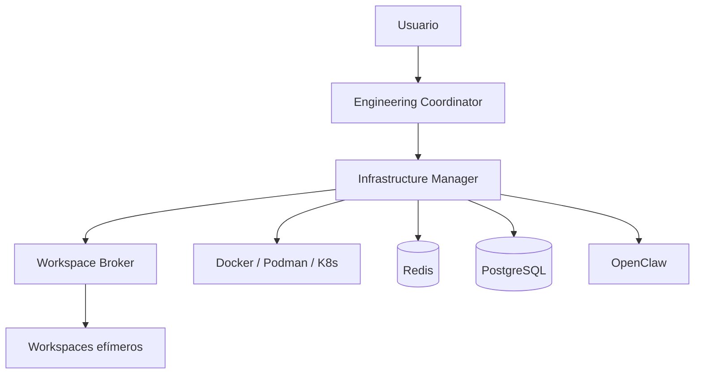

# JAFNE

**Jarvis Assistant For N→ Software Engineering**

JAFNE es un sistema de orquestación de ingeniería de software asistida por IA. No es un
chatbot ni un único agente: coordina múltiples agentes de IA **y** los **entornos de
ejecución** (workspaces efímeros) donde esos agentes diseñan, documentan, construyen,
prueban y despliegan software.

> Antes se llamaba *Engineering OS*. Desde la v0.2 el proyecto es **JAFNE**
> (ver [ADR-0001](docs/adr/0001-rebrand-engineering-os-a-jafne.md)).

## Idea central

Un agente **nunca** prepara sus dependencias a mano ni ejecuta Docker directamente. Le
**pide un Workspace** al sistema de infraestructura y trabaja dentro de él. La tecnología
de virtualización (Docker, Podman, Kubernetes, nodos distribuidos vía ZeroTier) queda
**completamente desacoplada** del comportamiento de los agentes.

## Cómo está organizado este repo

JAFNE se documenta en **dos zonas** con estándares distintos (ver [`WORKFLOW.md`](WORKFLOW.md)):

| Zona | Qué contiene | Estándar |
|---|---|---|
| [`investigacion/`](investigacion/) | Diseño **exploratorio**: opciones, trade-offs y descartes. Es donde vive el brainstorming. | Casa Justina (evolutivo) |
| [`docs/`](docs/) | Lo **congelado**: arquitectura aceptada y decisiones. | ADR + docs técnicas |

**Regla de graduación:** una investigación *gradúa* a un ADR en [`docs/adr/`](docs/adr/)
cuando la decisión se congela y pasa a restringir el diseño o el código.

## Estado

🚧 **En diseño / brainstorming.** El grueso del trabajo vive hoy en
[`investigacion/`](investigacion/). Lo único congelado es el nombre (ADR-0001).
