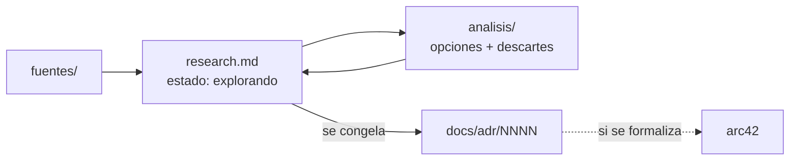

# WORKFLOW — cómo se documenta JAFNE

Método de trabajo del repo. JAFNE está en fase de **diseño/brainstorming**, así que la
documentación es en su mayoría **exploratoria** y evoluciona.

## Los tres modos de documentar

En estos proyectos se documenta de tres formas, según el grado de madurez:

1. **ADR** — *Architecture Decision Records*. Decisiones congeladas, una por archivo,
   numeradas y **append-only**: una decisión superada no se edita, se crea un ADR nuevo
   que la reemplaza. Viven en [`docs/adr/`](docs/adr/).
2. **Casa Justina** — estándar **evolutivo/exploratorio** (inspirado en
   [casaJustina](https://github.com/osorio-cristian-wt/casaJustina) y
   [docs-organizacion](https://github.com/BoRR-Pizzeria/docs-organizacion)). Cada tema de
   diseño vive en [`investigacion/<tema>/`](investigacion/) con `research.md` + `analisis/`
   + `fuentes/`. Es donde se guardan las **opciones descartadas** y el razonamiento — algo
   que un ADR no admite.
3. **arc42** — para cuando el proyecto se **formaliza**. Es una plantilla de arquitectura
   más rígida (12 secciones). JAFNE **todavía no** la usa; se adoptará cuando el diseño
   se estabilice y convenga una vista formal. Ver [arc42.org](https://arc42.org/).

**Hoy JAFNE usa el híbrido ADR + Casa Justina.** arc42 queda como destino futuro.

> Estos tres modos no son arbitrarios: se mapean a la **jerarquía de roles** de JAFNE
> (Asistente → Encargado → Agentes), donde cada nivel documenta con un estándar distinto.
> Ver [`investigacion/jerarquia-de-roles/`](investigacion/jerarquia-de-roles/research.md).

## Flujo: de la exploración a lo congelado



## Estructura de una investigación (Casa Justina)

Cada tema de diseño vive en `investigacion/<tema>/`:

```
investigacion/<tema>/
  research.md      ← síntesis: narra el tema, marca su estado, enlaza análisis y fuentes
  analisis/        ← deep-dives, un archivo por sub-problema (acá viven los descartes)
    README.md      ← índice (una línea por análisis)
    <sub-tema>.md
  fuentes/         ← material citado, numerado
    README.md      ← índice
    NN_slug.md     ← 01_, 02_, ...
```

- **`research.md` es el punto de entrada** y marca el estado: `explorando`,
  `en prototipo`, o `graduado a ADR-XXXX`.
- **`analisis/`** descompone en sub-problemas y deja **por qué se descarta** cada opción.
- **`fuentes/`** guarda material externo o heredado, numerado `NN_slug.md`.

## Reglas transversales

- **Un tema por archivo**, `kebab-case`, nombre estable. Cada carpeta tiene un `README.md`
  índice, actualizado en el mismo commit que agrega o mueve un doc.
- **Docs técnicos congelados** (en `docs/`) llevan front-matter con `fuentes` (de qué
  derivan) y `verificado` (fecha absoluta):

  ```markdown
  ---
  fuentes:
    - investigacion/orquestacion-entornos/research.md
  verificado: 2026-07-23
  ---
  ```

- **Diagramas en Mermaid**, nunca imágenes.
- **Fechas absolutas** (2026-07-23), nunca "hace dos semanas".
- **Idioma español**; términos técnicos en inglés cuando son estándar (workspace,
  snapshot, broker).

## Git

- **Commits**: [Conventional Commits](https://www.conventionalcommits.org/)
  (`feat:`, `fix:`, `docs:`, `chore:`, `refactor:`) con cuerpo en español.
  **Sin trailers de atribución de herramientas.**
