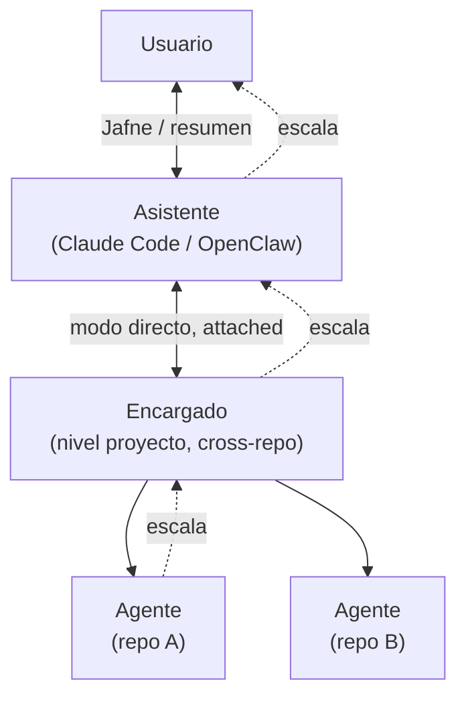

# ADR-0002 — Jerarquía de roles, escalación y modos de comunicación

- **Estado**: Aceptada
- **Fecha**: 2026-07-23

## Contexto

JAFNE necesita una cadena de mando clara entre quién habla con el usuario, quién piensa a
nivel proyecto, y quién ejecuta en cada repositorio — y una forma consistente de resolver
qué pasa cuando un nivel no puede resolver algo por sí solo.

## Decisión

JAFNE opera con **tres niveles** más el Usuario como autoridad final:

**Escalación estricta, sin saltar capas:** un Agente que no puede resolver algo escala al
Encargado; el Encargado escala al Asistente; el Asistente es el **único** nivel que habla
con el Usuario. Aprobar una capacidad nueva (ver
[ADR-0004](./0004-capacidades-por-repositorio.md)) sigue siempre esta cadena completa —
el Encargado nunca aprueba solo.

**Dos modos de comunicación Usuario ↔ Encargado:**

| Modo | Cómo funciona |
|---|---|
| **Directo (attached)** | El Usuario habla con el Encargado sin resumen intermedio del Asistente. Para iteración profunda de diseño/dev. |
| **Delegado (async)** | El Usuario delega una tarea; el Encargado trabaja (posiblemente en background); al terminar avisa al Asistente, que resume al Usuario **manteniendo la voz del Encargado** (no reinterpreta con estilo propio) y sin una segunda pasada pesada de razonamiento. |

**Palabra clave "Jafne":** invoca al Asistente y media el cambio a modo directo (ej.
*"Jafne, quiero hablar directo con el Encargado de BoRR"*). Una vez adentro, el Usuario
queda enganchado directo con ese Encargado hasta que cierra la sesión o vuelve a decir
"Jafne".

## Alternativas descartadas

- **Cualquier nivel puede hablar directo con el Usuario (saltando capas):** descartado —
  rompe la cadena de mando y duplica el punto de contacto humano.
- **El Encargado aprueba capacidades nuevas por su cuenta:** descartado — agregar una
  capacidad cambia lo que un repo puede hacer permanentemente; el Usuario mantiene el
  control ahí.
- **El Asistente siempre reprocesa/resume con su propia voz, incluso en delegado:**
  descartado — el Usuario quiere sentir que habla con el Encargado, no con un
  intermediario; además cuesta tokens de más.
- **Una palabra clave propia por Encargado (sin mediación del Asistente):** descartado —
  el Asistente sigue siendo el único punto de entrada; un solo wake word para todo el
  sistema.

## Consecuencias

- El Asistente debe soportar dos modos de relay: *pass-through* (directo) y *resumen
  liviano preservando voz* (delegado).
- Toda interacción de aprobación humana (capacidades, decisiones que exceden al
  Encargado) pasa por el Asistente, nunca directo Encargado→Usuario.
- Queda abierto (posible investigación futura) cómo se comporta el sistema con
  **múltiples Encargados activos** a la vez y qué pasa si la sesión directa se corta sin
  decir "Jafne".
