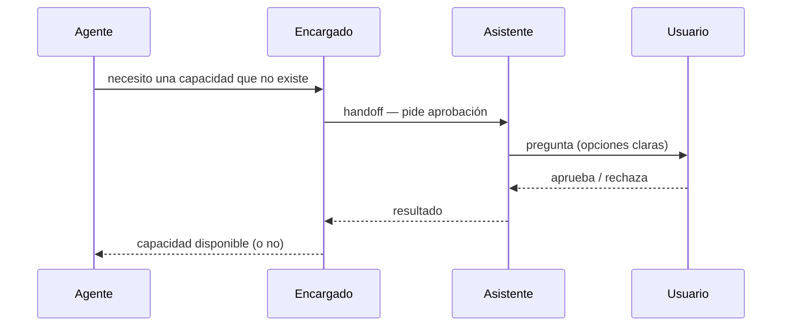

# ADR-0004 — Capacidades (skills + MCP) por repositorio

- **Estado**: Aceptada. *Su cadena de escalación fue reemplazada por [ADR-0049](./0049-el-encargado-siembra-el-entorno-y-las-skills-de-un-repo.md); el almacenamiento en el repo sigue vigente.*
- **Fecha**: 2026-07-23

## Contexto

Un Agente necesita saber qué sabe hacer en su repo (skills del dominio) y con qué se
conecta (servidores MCP), además del entorno donde corre
([`engineering.yaml`](../../examples/engineering.yaml)) y el cerebro que lo ejecuta
([ADR-0003](./0003-cerebro-por-rol-y-agnosticismo-de-proveedor.md)).

## Decisión

- Las **capacidades/skills** de un Agente se guardan **versionadas dentro del repo al
  que pertenecen** y se publican vía GitHub — el repo mismo es la unidad de
  almacenamiento y el canal de descubrimiento.
- Cuando un Agente o el Encargado necesita una capacidad que **no existe todavía**, se
  pide mediante la cadena de escalación completa
  ([ADR-0002](./0002-jerarquia-de-roles-escalacion-y-modos-de-comunicacion.md)): el
  Encargado nunca la aprueba solo — hace *handoff* al Asistente, que se lo pregunta al
  Usuario, quien aprueba o rechaza.

## Alternativas descartadas

- **El Encargado aprueba y crea capacidades nuevas por su cuenta:** descartado —
  agregar una capacidad cambia lo que un repo puede hacer de forma permanente; el
  Usuario mantiene el control humano ahí (mismo principio que en ADR-0002).

## Consecuencias

- Cada repo termina llevando, además de su código, la config de capacidades (skills +
  MCP) versionada junto a él — mismo patrón que ya usa BoRR-Pizzería en
  `backend-supabase` (`.claude/skills/` + `.mcp.json`), pero bajo la convención neutral
  de proveedor (`.agents/`) de
  [ADR-0003](./0003-cerebro-por-rol-y-agnosticismo-de-proveedor.md).
- Queda abierto si en algún momento aparecen capacidades genuinamente cross-repo que
  ameriten un registro compartido en vez de vivir solo en el repo que las usa.
