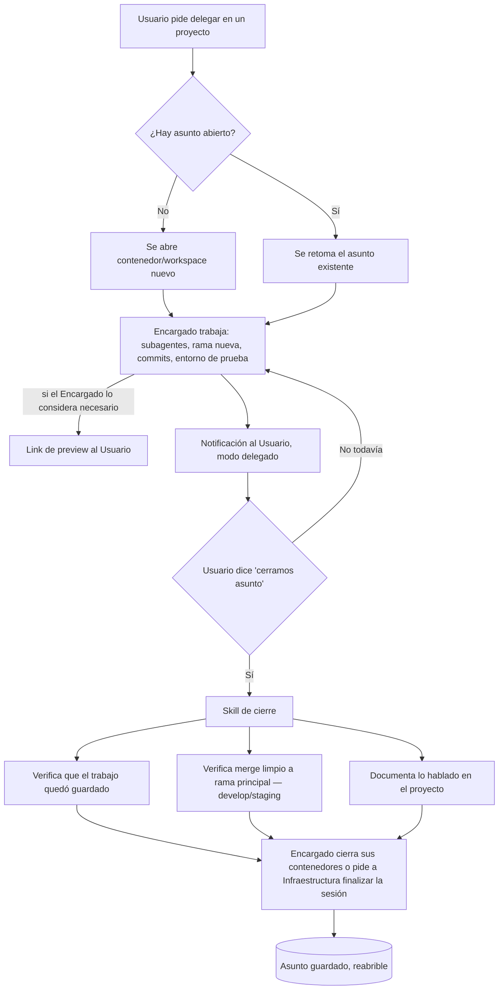

# ADR-0006 — Asuntos: unidad de trabajo persistente del Encargado y su ciclo de vida

- **Estado**: Aceptada
- **Fecha**: 2026-07-23

## Contexto

Hasta ahora la interacción con un Encargado se pensó como una conversación (modo directo
o delegado, [ADR-0002](./0002-jerarquia-de-roles-escalacion-y-modos-de-comunicacion.md)),
pero no había una unidad de trabajo persistente e independiente del chat: algo que siga
existiendo (con su contenedor, su rama, su estado) mientras el Usuario hace otras cosas y
vuelve más tarde, y que se pueda cerrar y reabrir explícitamente.

## Decisión

El trabajo del Encargado se organiza en **Asuntos**: la unidad persistente de trabajo,
distinta de una sesión de chat suelta. Un Asunto tiene contenedor/workspace propio,
estado propio, y un ciclo de vida explícito:

- **Apertura:** si el Usuario pide delegar en un proyecto y no hay un Asunto abierto, se
  abre un contenedor/workspace nuevo para ese Encargado. Si ya hay uno, se retoma.
- **Durante el Asunto:** el Encargado llama a sus subagentes (Agentes) para avanzar el
  requisito pedido: crea una rama nueva, delega el commit a un agente, genera un entorno
  de prueba. El contenedor persiste con su estado mientras el Asunto sigue abierto, sin
  importar si el Usuario está activamente conversando o haciendo otra cosa.
- **Preview opcional:** si el Encargado lo considera necesario (no siempre), genera un
  link para que el Usuario pruebe el resultado (ej. una web) — reutiliza el contrato
  `{workspace, status, url}` del Workspace Broker (ver
  [orquestación de entornos](../../investigacion/orquestacion-entornos/research.md)).
- **Notificación:** mientras el Asunto avanza, el Usuario puede seguir usando Jafne para
  otras cosas; le llega una notificación (modo delegado, ADR-0002) cuando hay algo para
  revisar.
- **Cierre explícito — "cerramos asunto":** dispara una skill de cierre que valida, en
  orden: (1) el trabajo quedó guardado, (2) el estado de git tiene su merge cerrado hacia
  la rama principal correspondiente (develop o staging, según el repo), (3) se documentó
  lo hablado en el proyecto, y otras validaciones a definir. Solo después de eso el
  Encargado cierra sus propios contenedores, o le pide a Infraestructura que finalice la
  sesión.
- **Persistencia:** los Asuntos cerrados quedan guardados y se pueden reabrir.

## Alternativas descartadas

- **Tratar cada interacción como una sesión de chat efímera, sin estado persistente entre
  mensajes:** descartado — el Usuario necesita irse y volver sin perder el contenedor ni
  el contexto del trabajo en curso.
- **Cerrar el contenedor automáticamente en cuanto el Usuario deja de escribir:**
  descartado — el Asunto sigue abierto (contenedor incluido) hasta un cierre explícito.
- **Mergear y cerrar sin validar el estado de git ni documentar:** descartado — el cierre
  de un Asunto es un punto de control, no un simple "terminar de hablar".

## Consecuencias

- El cierre de Asunto es la primera pieza concreta que resuelve la pregunta abierta de la
  **memoria de estado/sesión del Encargado**
  ([`docs/arquitectura.md`](../arquitectura.md)): documentar lo hablado pasa a ser un paso
  obligatorio del cierre, no un mecanismo separado a inventar desde cero. Dónde vive esa
  documentación se resuelve en
  [ADR-0007](./0007-jerarquia-de-directorios-de-jafne-implementado.md)
  (`~/.jafne/asuntos/<proyecto>/<asunto-id>/cierre.md`).
- Cada Asunto probablemente mapea 1:1 a una rama de trabajo por proyecto/requisito; la
  convención exacta de nombres y a qué rama principal mergea (develop/staging) depende de
  cada repo (ver convenciones ya existentes en repos de agente, ej.
  `feature/* → develop → staging → production`).
- Falta definir el catálogo completo de "otras validaciones" del cierre, y el mecanismo
  concreto de reapertura de un Asunto guardado.
