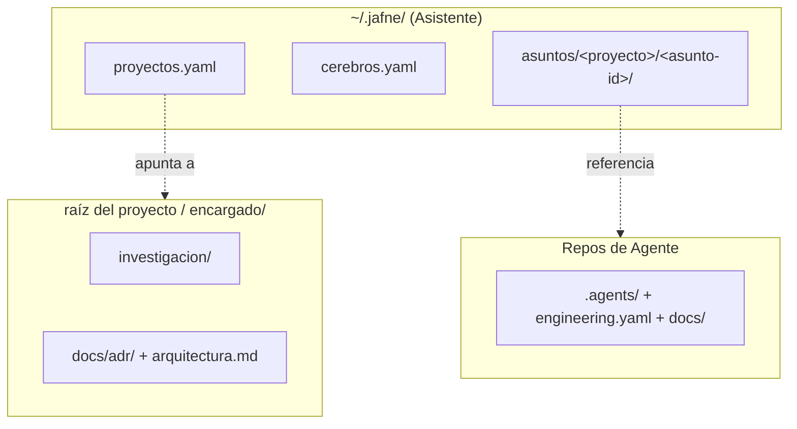

# ADR-0007 — Jerarquía de directorios de un JAFNE implementado

- **Estado**: Aceptada
- **Fecha**: 2026-07-23

## Contexto

Con los roles, la escalación, el cerebro por rol, las capacidades y los Asuntos ya
decididos ([ADR-0002](./0002-jerarquia-de-roles-escalacion-y-modos-de-comunicacion.md) a
[ADR-0006](./0006-asuntos-unidad-de-trabajo-y-ciclo-de-vida.md)), falta fijar **dónde
vive cada cosa** en el sistema de archivos para que Asistente, Encargados y Agentes sepan
dónde leer y escribir.

## Decisión

Tres ubicaciones:

1. **`~/.jafne/`** — estado del Asistente, local y cross-proyecto. Es la **fuente de
   verdad** de los Asuntos (ADR-0006): estado, contenedor, rama, links de preview, y la
   documentación de cierre. No vive versionado dentro del proyecto — es estado operativo
   del sistema, no documentación de diseño.
   - `proyectos.yaml` — registro de proyectos conocidos → ruta de su repo `encargado/`.
   - `cerebros.yaml` — proveedores de IA disponibles (ADR-0003).
   - `asuntos/<proyecto>/<asunto-id>/` — `meta.yaml` (estado del Asunto y del
     contenedor, ver [ADR-0008](./0008-estado-de-asuntos-y-panel-web.md)) + `cierre.md`
     (documentación de cierre).

2. **`<raíz-del-proyecto>/encargado/`** — un único repo dedicado por proyecto para el
   Encargado, con la misma forma híbrida que el propio repo `jafne`: `investigacion/`
   (Casa Justina) + `docs/adr/` + `docs/arquitectura.md` + `GLOSARIO.md` +
   `WORKFLOW.md`. Reemplaza, unificado en un solo repo, el rol que hoy cumplen por
   separado `docs-organizacion` y `.github` en BoRR-Pizzería.

3. **Repos de Agente** (sin cambios) — cada uno mantiene su propio `docs/` (arc42 o ADR,
   a criterio del repo), más `.agents/` (cerebro + capacidades,
   [ADR-0003](./0003-cerebro-por-rol-y-agnosticismo-de-proveedor.md)/
   [ADR-0004](./0004-capacidades-por-repositorio.md)) y `engineering.yaml`
   (infraestructura).

## Alternativas descartadas

- **Dos repos por proyecto (como BoRR hoy: `docs-organizacion` + `.github`):**
  descartado — el propio JAFNE ya usa un solo repo con `investigacion/` + `docs/adr/`
  adentro; se mantiene consistencia con ese modelo en vez de heredar la fragmentación
  histórica de BoRR.
- **Los Asuntos versionados dentro del repo `encargado/` del proyecto:** descartado — un
  Asunto es estado operativo de sesión (contenedor, rama activa, notificaciones), no
  investigación ni una decisión de diseño; vive en el estado del Asistente, no en el
  historial de git del proyecto.

## Consecuencias

- Resuelve la pregunta abierta de [ADR-0006](./0006-asuntos-unidad-de-trabajo-y-ciclo-de-vida.md)
  sobre dónde vive la documentación de cierre de un Asunto: en
  `~/.jafne/asuntos/<proyecto>/<asunto-id>/cierre.md`, no en el repo del proyecto.
- Reabrir un Asunto es una operación puramente local del Asistente (leer
  `~/.jafne/asuntos/...`), no requiere tocar git del proyecto salvo para retomar la rama
  ya creada.
- Queda abierto qué pasa si `~/.jafne/` se pierde (¿los Asuntos cerrados son recuperables
  solo desde ahí, o el cierre también deja algún rastro mínimo en el proyecto, como un
  mensaje de merge descriptivo?).
