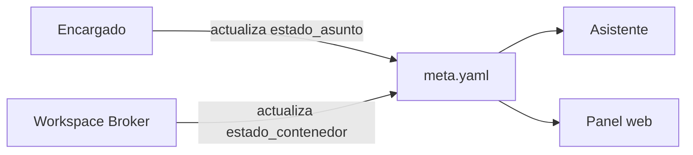

# ADR-0008 — Estado de Asuntos, estado de contenedor y panel web de observabilidad

- **Estado**: Aceptada, matizada por [ADR-0043](./0043-los-chats-del-asistente-se-guardan.md)
- **Fecha**: 2026-07-23

## Contexto

[ADR-0006](./0006-asuntos-unidad-de-trabajo-y-ciclo-de-vida.md) definió el ciclo de vida
de un Asunto (abierto/cerrado) y [ADR-0007](./0007-jerarquia-de-directorios-de-jafne-implementado.md)
dónde vive su registro (`~/.jafne/asuntos/`). Falta precisar qué estados concretos puede
tener un Asunto mientras está abierto, que el Asistente pueda consultarlos a través de
todos los Encargados, y cómo el Usuario los visualiza sin depender de una conversación.

## Decisión

- **Estado del Asunto** — lo actualiza el propio Encargado, vive en `meta.yaml`
  ([ADR-0007](./0007-jerarquia-de-directorios-de-jafne-implementado.md)). Catálogo
  cerrado en [ADR-0009](./0009-catalogo-cerrado-estado-asunto.md): `iniciando`,
  `interactuando_con_el_usuario`, `esperando_respuesta`, `cerrando`, `cerrado`.
- **Estado del contenedor** — lo gestiona Infraestructura/Workspace Broker (ver
  [orquestación de entornos](../../investigacion/orquestacion-entornos/research.md)): ej.
  activo, suspendido, destruido. Es un **eje independiente** del estado del Asunto: un
  Asunto "esperando_respuesta" puede tener su contenedor suspendido para no gastar
  recursos; uno "interactuando_con_el_usuario" lo tiene activo.
- **El Asistente puede leer el estado de todos los Encargados** — todos los Asuntos, de
  cualquier proyecto — porque `~/.jafne/asuntos/` ya es su propio estado
  (ADR-0007); no hace falta un canal aparte.
- **Panel web**: una página para acceder a Jafne y ver cómo están los Asuntos/sesiones.
  Lee la misma fuente que consulta el Asistente (`~/.jafne/asuntos/`), no un almacén
  propio separado.

## Alternativas descartadas

- **Un solo campo combinado de estado (Asunto + contenedor):** descartado — se pisan
  entre sí (ej. no se puede representar "esperando respuesta" con contenedor suspendido
  si es un único valor).
- **El panel web con su propio almacén de estado:** descartado — duplicaría la fuente de
  verdad; el panel lee lo mismo que ya consulta el Asistente.

## Consecuencias

- `meta.yaml` (ADR-0007) necesita, como mínimo, dos campos: `estado_asunto` y
  `estado_contenedor`.
- El panel web es, en principio, un consumidor de **solo lectura** de `~/.jafne/` vía el
  Asistente.
- El catálogo cerrado de `estado_asunto` quedó resuelto en
  [ADR-0009](./0009-catalogo-cerrado-estado-asunto.md).
- Sigue abierto: mecanismo de autenticación y hosting del panel web (¿corre local, o
  accede a `~/.jafne/` de forma remota si el Usuario no está en la misma máquina?); si el
  panel permite acciones (cerrar un asunto, aprobar una capacidad) o es solo
  observabilidad.
