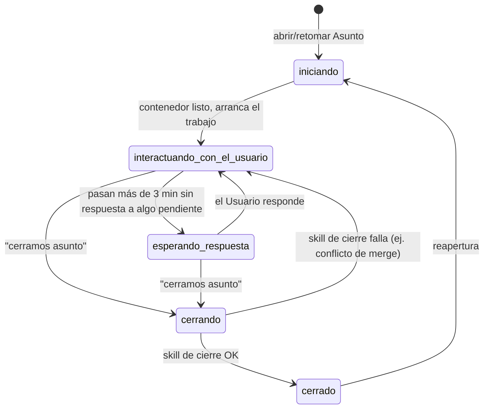

# ADR-0009 — Catálogo cerrado de `estado_asunto`

- **Estado**: Aceptada
- **Fecha**: 2026-07-23

## Contexto

[ADR-0008](./0008-estado-de-asuntos-y-panel-web.md) dejó abierto si un primer borrador de
estados era el catálogo completo. El catálogo es **cerrado**, con cinco valores.

## Decisión

- **`iniciando`** — el Asunto se está abriendo: se crea o retoma el contenedor y se
  prepara el entorno; todavía no arrancó el trabajo en sí.
- **`interactuando_con_el_usuario`** — hay actividad en curso, sin nada pendiente de
  respuesta: conversación activa (modo directo) o el Encargado/sus Agentes trabajando y
  reportando avances (modo delegado).
- **`esperando_respuesta`** — se le preguntó algo al Usuario (aprobar una capacidad —
  [ADR-0004](./0004-capacidades-por-repositorio.md)—, confirmar un paso, revisar un link,
  confirmar el cierre) y pasaron **más de 3 minutos** sin respuesta. Es una transición
  **automática por timeout** desde `interactuando_con_el_usuario`, no algo que el
  Encargado declare directamente.
- **`cerrando`** — se disparó "cerramos asunto" y está corriendo la skill de cierre
  ([ADR-0006](./0006-asuntos-unidad-de-trabajo-y-ciclo-de-vida.md)): verificar guardado,
  merge limpio, documentar lo hablado.
- **`cerrado`** — la skill de cierre terminó OK; el Asunto queda guardado y reabrible.

## Alternativas descartadas

- **El catálogo original de este mismo ADR** (`trabajando` / `esperando_respuesta` /
  `finalizado_sin_cerrar` / `cerrado`): descartado por corrección directa del usuario —
  no distinguía la apertura (`iniciando`) ni el cierre en curso (`cerrando`) como estados
  propios, y no ataba `esperando_respuesta` a una regla concreta (timeout de 3 minutos).
- **Un estado de error/bloqueado separado de `esperando_respuesta`:** descartado — el
  `motivo` alcanza para distinguir internamente sin inflar el catálogo.
- **Dejar el catálogo abierto/extensible libremente:** descartado — el panel web
  ([ADR-0008](./0008-estado-de-asuntos-y-panel-web.md)) necesita un conjunto fijo para
  representar iconos/colores consistentes; un estado nuevo requeriría reemplazar este ADR.

## Consecuencias

- `meta.yaml` guarda `estado_asunto` (uno de los cinco valores), un timestamp de la
  última actividad (para calcular el timeout de 3 minutos) y un campo `motivo` para dar
  contexto sin multiplicar estados.
- El paso de `interactuando_con_el_usuario` a `esperando_respuesta` es automático (por
  tiempo), no algo que el Encargado declare — hace falta un mecanismo de reloj/scheduler
  que lo dispare.
- `cerrando` puede fallar y volver a `interactuando_con_el_usuario` si la skill de cierre
  encuentra un problema (ej. conflicto de merge) — el cierre no es instantáneo ni
  infalible.
- Cualquier estado nuevo que se necesite en el futuro reemplaza este ADR (no se edita).
