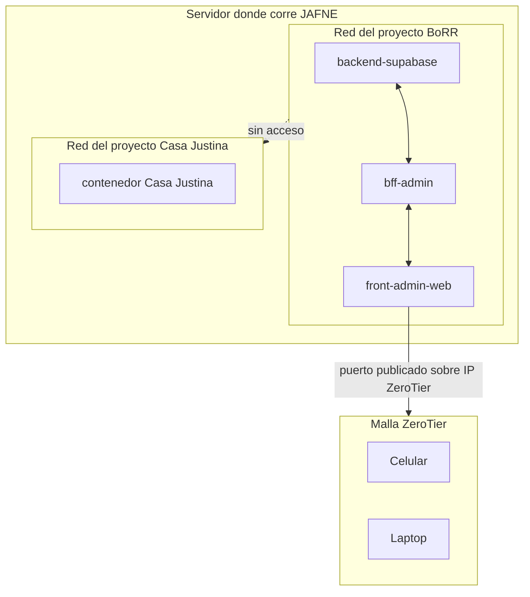

# ADR-0011 — Redes y puertos de un Workspace: aislamiento por proyecto, comunicación intra-proyecto y exposición vía ZeroTier

- **Estado**: Aceptada. *Matizada por [ADR-0050](./0050-descubrimiento-por-alias-y-registro-de-puertos.md).*
- **Fecha**: 2026-07-23

## Contexto

[Orquestación de entornos](../../investigacion/orquestacion-entornos/research.md) ya
estableció que un Agente pide un Workspace sin conocer la tecnología de virtualización de
abajo. Faltaba precisar quién define los contenedores concretos y cómo se maneja la red
entre ellos — especialmente cuando un proyecto (como BoRR) tiene varios repos, cada uno
con su propio contenedor, y el servidor donde corre JAFNE se accede remotamente desde
varios dispositivos vía ZeroTier.

## Decisión

- **Los contenedores se comitean a nivel de repo.** El Dockerfile/compose de un repo vive
  versionado en ese mismo repo — es la misma herramienta que sirve para deploy y para el
  entorno de pruebas del Agente, no una definición separada gestionada por fuera.
- **El Workspace (vía Infraestructura) es responsable de la red y los puertos**, no el
  Agente ni el Encargado:
  - **Aislamiento entre proyectos** — el Encargado (y los contenedores) de un proyecto no
    pueden acceder a los contenedores de otro proyecto (ej. el Encargado de BoRR no llega
    a un contenedor de Casa Justina).
  - **Comunicación abierta intra-proyecto** — los contenedores de los distintos repos de
    un mismo proyecto (ej. BoRR: backend, bff, front) se intercomunican con puertos
    abiertos entre sí.
  - **Exposición remota vía ZeroTier** — los servicios que necesitan alcance externo (ej.
    el front, para que el Usuario pruebe un link — [ADR-0006](./0006-asuntos-unidad-de-trabajo-y-ciclo-de-vida.md))
    publican su puerto sobre la interfaz de la malla ZeroTier, no sobre la red pública —
    así se accede desde celular/laptop en remoto sin exponer el servidor a internet.

## Alternativas descartadas

- **Un único contenedor gigante por proyecto (monolito de infra):** descartado —
  contradice la idea ya establecida de un repo = un Agente con su propio entorno
  ([ADR-0004](./0004-capacidades-por-repositorio.md)).
- **Exponer puertos directamente a la red pública (`0.0.0.0`):** descartado — el acceso
  remoto es solo vía la malla ZeroTier, no internet abierto.
- **Una sola red compartida entre todos los proyectos:** descartado — rompe el
  aislamiento que pide el Usuario (BoRR no debe ver contenedores de Casa Justina).

## Consecuencias

- Cada proyecto necesita su propia red virtual (una red por proyecto, no por repo); la
  tecnología concreta de contenedores que la implementa se resuelve aparte.
- El Infrastructure Manager, al armar un Workspace, tiene que unir el contenedor del repo
  a la red del proyecto correspondiente (y, si aplica, publicar su puerto sobre la IP de
  la interfaz ZeroTier) — el repo no declara la red de la que forma parte, solo su propio
  servicio; mantiene el principio de "Agentes agnósticos de infraestructura"
  ([`docs/arquitectura.md`](../arquitectura.md)).
- Falta definir el mecanismo exacto de descubrimiento de servicios dentro de un proyecto
  (¿DNS por nombre de servicio, IP fija, variables de entorno inyectadas?) y cómo se le
  asigna una IP ZeroTier estable al servidor donde corre JAFNE.
