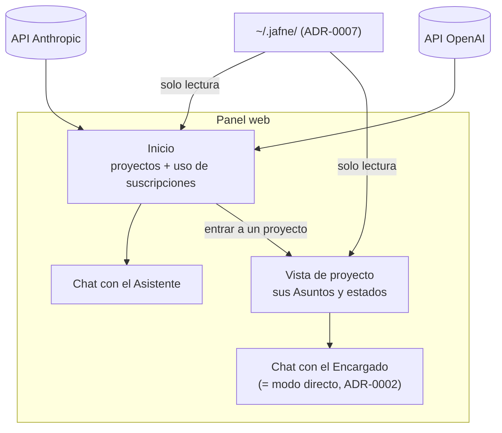

# ADR-0013 — Panel web como dashboard visual: proyectos, chat y uso de suscripciones

- **Estado**: Aceptada
- **Fecha**: 2026-08-11

## Contexto

[ADR-0008](./0008-estado-de-asuntos-y-panel-web.md) definió el panel web como una página
para ver cómo están los Asuntos, leyendo `~/.jafne/asuntos/`, y lo dejó "en principio"
como consumidor de **solo lectura** — con la pregunta abierta explícita de si el panel
permite acciones o es solo observabilidad.

Requisito directo del Usuario (2026-08-11), documentado directo como ADR según
[ADR-0005](./0005-cuando-investigar-vs-adr-directo.md): el panel es un **dashboard
visual** desde el cual se opera JAFNE, no una vista pasiva.

## Decisión

El panel web es el **punto de entrada gráfico** a JAFNE. Tiene cuatro funciones:

1. **Ver los proyectos** — lista los proyectos conocidos (`proyectos.yaml`,
   [ADR-0007](./0007-jerarquia-de-directorios-de-jafne-implementado.md)) con sus Asuntos y
   el estado de cada uno ([ADR-0009](./0009-catalogo-cerrado-estado-asunto.md)).
2. **Chatear con el Asistente** — desde el nivel raíz del panel, sin haber entrado a
   ningún proyecto.
3. **Chatear con el Encargado al entrar a un proyecto** — entrar a un proyecto en el panel
   es la forma **gráfica** del modo directo (attached) de
   [ADR-0002](./0002-jerarquia-de-roles-escalacion-y-modos-de-comunicacion.md): el
   interlocutor pasa a ser el Encargado de ese proyecto. La palabra clave "Jafne" sigue
   siendo el equivalente conversacional del mismo cambio de modo.
4. **Ver el uso de las suscripciones** — consumo de las suscripciones de **Anthropic** y
   **OpenAI**, los proveedores iniciales de [ADR-0010](./0010-proveedores-iniciales-asistente.md).

## Alternativas descartadas

- **Panel de solo observabilidad**, como asumía "en principio"
  [ADR-0008](./0008-estado-de-asuntos-y-panel-web.md): descartado por este requisito — el
  Usuario quiere **operar** desde el panel (chatear, entrar a un proyecto), no solamente
  mirar el estado.
- **Un panel por proyecto, sin vista raíz cross-proyecto:** descartado — el Asistente ya
  ve todos los Asuntos de todos los proyectos (ADR-0008); el panel refleja esa misma vista
  única en vez de fragmentarse.
- **Ver el uso de suscripciones en una herramienta aparte (las consolas de cada
  proveedor):** descartado — el gasto es una señal operativa de JAFNE, sobre todo con la
  política de "más tokens antes que rehacer"
  ([ADR-0003](./0003-cerebro-por-rol-y-agnosticismo-de-proveedor.md)); tiene que verse
  junto al trabajo que lo genera.

## Consecuencias

- **Resuelve la pregunta abierta de [ADR-0008](./0008-estado-de-asuntos-y-panel-web.md)**
  sobre si el panel permite acciones: **sí**. El panel deja de ser solo lectura. Lo que
  sigue siendo solo lectura es el **estado** de Asuntos y contenedores: el panel lo
  muestra, pero no lo escribe — lo escriben el Encargado y el Workspace Broker (ADR-0008).
- El chat del panel necesita un **canal hacia una sesión viva** del Asistente o del
  Encargado. Ese transporte **no está decidido** y se cruza con
  [`investigacion/protocolo-de-asignacion-de-tareas/`](../../investigacion/protocolo-de-asignacion-de-tareas/research.md).
  Hasta que se decida, el panel expone la interfaz de chat pero no la cablea.
- Mostrar el uso de las suscripciones implica que el panel maneja **credenciales** de
  Anthropic y OpenAI. El manejo de secretos sigue abierto en
  [`docs/arquitectura.md`](../arquitectura.md); tampoco está decidido de qué fuente sale
  el consumo (API de administración de cada proveedor, contabilidad propia por llamada, o
  ambas).
- **Sigue abierto** de ADR-0008: autenticación y hosting del panel (¿local, o acceso
  remoto vía ZeroTier — [ADR-0011](./0011-redes-y-puertos-de-workspace.md)?). Con el panel
  ahora operable, esta pregunta pesa más que cuando era solo lectura.
- El catálogo cerrado de `estado_asunto` (ADR-0009) cumple acá su propósito declarado:
  darle al panel un conjunto fijo de estados para iconos y colores consistentes.
