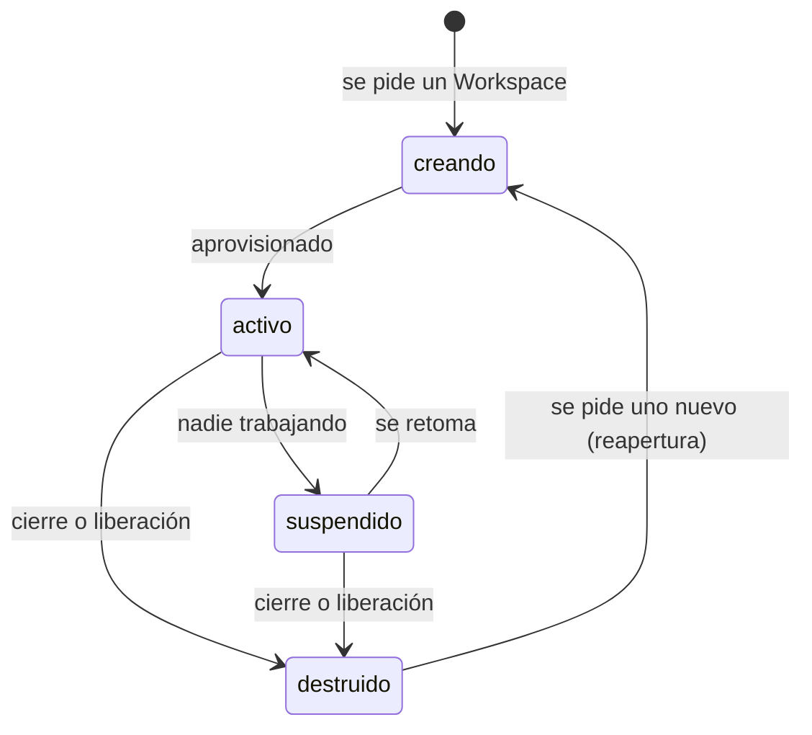

# ADR-0016 — Catálogo cerrado de `estado_contenedor`

- **Estado**: Aceptada. *Matizada por [ADR-0047](./0047-los-contenedores-son-por-repositorio.md).*
- **Fecha**: 2026-08-11

## Contexto

[ADR-0008](./0008-estado-de-asuntos-y-panel-web.md) definió `estado_contenedor` como un eje
independiente del estado del Asunto y lo ejemplificó ("activo, suspendido, destruido"),
pero —a diferencia de `estado_asunto` en
[ADR-0009](./0009-catalogo-cerrado-estado-asunto.md)— nunca lo declaró cerrado. La
implementación lo tuvo que tratar como texto libre.

## Decisión

Catálogo **cerrado** de cuatro valores, que escribe Infraestructura / el Workspace Broker:

- **`creando`** — se está aprovisionando el Workspace: imagen, red del proyecto, montajes.
  Todavía no se puede ejecutar nada adentro.
- **`activo`** — el Workspace está en pie y acepta trabajo.
- **`suspendido`** — el Workspace existe pero no consume cómputo. Es el estado natural de
  un Asunto en `esperando_respuesta` (ADR-0009): nadie está trabajando, pero el entorno no
  se tira.
- **`destruido`** — el Workspace se liberó. El Asunto puede seguir existiendo sin él
  (ver [ADR-0018](./0018-reapertura-de-asuntos.md)).

Un Asunto sin `estado_contenedor` (campo ausente) es un Asunto que **nunca tuvo**
Workspace — no es lo mismo que `destruido`.

## Alternativas descartadas

- **Dejarlo como texto libre:** descartado por la misma razón que ADR-0009 cerró el otro
  catálogo — el panel ([ADR-0013](./0013-panel-web-como-dashboard-visual.md)) necesita un
  conjunto fijo para iconos y colores consistentes, y un valor nuevo que aparezca sin
  aviso se renderiza como "desconocido".
- **Reusar los estados del motor de contenedores (Podman: `created`, `running`, `paused`,
  `exited`…):** descartado — ata el contrato del Workspace Broker al vocabulario de un
  motor concreto, justo lo que [ADR-0012](./0012-motor-de-contenedores-podman.md) mantiene
  oculto detrás del Broker.
- **Un estado `error` separado:** descartado por simetría con ADR-0009 — el campo `motivo`
  alcanza para distinguir sin inflar el catálogo.

## Consecuencias

- Un `estado_contenedor` fuera del catálogo se rechaza al leer `meta.yaml`, igual que un
  `estado_asunto` inválido.
- Los dos ejes siguen siendo independientes (ADR-0008): cualquier combinación de
  `estado_asunto` × `estado_contenedor` es representable, y varias son normales
  (`esperando_respuesta` + `suspendido`, `cerrado` + `destruido`).
- Un valor nuevo en el futuro reemplaza este ADR, no lo edita.
