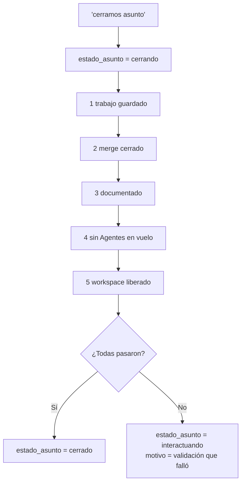

# ADR-0019 — Catálogo cerrado de validaciones del cierre de un Asunto

- **Estado**: Aceptada
- **Fecha**: 2026-08-11

## Contexto

[ADR-0006](./0006-asuntos-unidad-de-trabajo-y-ciclo-de-vida.md) definió el cierre como un
punto de control con tres validaciones —trabajo guardado, merge limpio, lo hablado
documentado— seguidas de "y otras validaciones a definir". Con el catálogo incompleto, la
skill de cierre no se podía implementar: correr un cierre a medias es peor que no
correrlo.

## Decisión

Catálogo **cerrado** de cinco validaciones, en orden. La skill de cierre las corre todas y
reporta cada una con su resultado y su motivo:

1. **Trabajo guardado** — no quedan cambios sin commitear en las ramas del Asunto.
2. **Merge cerrado** — la rama del Asunto está mergeada a la rama principal que
   corresponda al repo (develop o staging, según sus convenciones).
3. **Lo hablado documentado** — existe el `cierre.md` del Asunto
   ([ADR-0007](./0007-jerarquia-de-directorios-de-jafne-implementado.md)) y quedó la
   entrada de bitácora en el repo `encargado/`
   ([ADR-0021](./0021-bitacora-de-cierre-en-el-repo-encargado.md)).
4. **Sin Agentes en vuelo** — ningún Agente ni subagente del Asunto sigue trabajando.
   Cerrar con un Agente a mitad de un commit es cómo se pierde trabajo.
5. **Workspace liberado** — el contenedor del Asunto quedó en `destruido`
   ([ADR-0016](./0016-catalogo-cerrado-estado-contenedor.md)), o el Asunto nunca tuvo uno.

**El cierre es todo o nada:** si alguna validación falla, el Asunto vuelve a
`interactuando_con_el_usuario` (ADR-0009) llevando **cuál** falló y por qué. No hay cierre
parcial ni forzado.

## Alternativas descartadas

- **Dejar el catálogo abierto/extensible:** descartado por la misma razón que
  [ADR-0009](./0009-catalogo-cerrado-estado-asunto.md) cerró el de estados — un cierre
  cuyo criterio cambia sin dejar rastro no es un punto de control, y el panel no puede
  mostrar de forma consistente qué falta.
- **Un `--force` para cerrar saltando validaciones:** descartado — la primera vez que se
  usa deja de ser excepción. Si una validación estorba de verdad, se reemplaza este ADR.
- **Validar en paralelo:** descartado — el orden es informativo. Si el trabajo no está
  guardado, que además falle el merge no aporta nada; se reporta la primera causa real.
- **Cerrar el Workspace antes de validar:** descartado — se pierde justamente el entorno
  donde se podría diagnosticar por qué falló el cierre.

## Consecuencias

- La skill de cierre es implementable: hay un contrato fijo de qué verifica y qué reporta.
- Las validaciones 4 y 5 dependen de Infraestructura. Mientras el Workspace Broker no
  exista, un Asunto sin contenedor las pasa **vacuosamente** (no hay Agentes que estén
  corriendo ni Workspace que liberar); en cuanto haya Broker, pasan a ser verificaciones
  reales sin cambiar este catálogo.
- El `motivo` de ADR-0009 gana un uso concreto: nombrar la validación que bloqueó el
  cierre.
- Reabrir un Asunto cerrado ([ADR-0018](./0018-reapertura-de-asuntos.md)) no re-corre
  estas validaciones hacia atrás — el cierre anterior ya fue válido en su momento.
