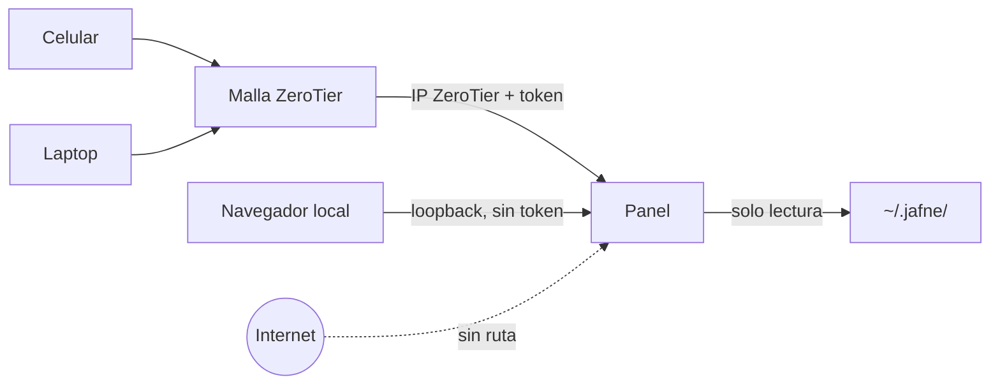

# ADR-0020 — Hosting y autenticación del panel: interfaz ZeroTier y token

- **Estado**: Aceptada
- **Fecha**: 2026-08-11

## Contexto

[ADR-0008](./0008-estado-de-asuntos-y-panel-web.md) dejó abiertos el hosting y la
autenticación del panel. [ADR-0013](./0013-panel-web-como-dashboard-visual.md) subió la
apuesta: el panel dejó de ser solo observabilidad y pasó a ser el punto de entrada desde el
que se **opera** JAFNE. Un panel expuesto sin control de acceso ya no es una vista de
estado — es una consola de control abierta.

[ADR-0011](./0011-redes-y-puertos-de-workspace.md) ya resolvió el problema hermano para los
servicios de un proyecto: se publican sobre la interfaz de la malla ZeroTier, nunca sobre
la red pública.

## Decisión

- **El panel corre en el servidor donde corre JAFNE**, junto a `~/.jafne/`. No hay acceso
  remoto al almacén: lo remoto es el panel, no el sistema de archivos.
- **Escucha en loopback o en la interfaz ZeroTier del servidor.** Nunca en `0.0.0.0` ni
  `::` — bindear todas las interfaces se rechaza explícitamente, igual que ADR-0011
  descartó exponer puertos a la red pública.
- **Token compartido obligatorio para todo bind no-loopback.** La malla ZeroTier ya es una
  red autenticada —un dispositivo tiene que estar autorizado para entrar—, pero eso
  autentica al *dispositivo*, no a quien lo está usando. El token es la segunda capa, y su
  ausencia impide levantar el panel fuera de loopback.
- **Un solo Usuario, un solo token.** JAFNE no tiene multi-usuario
  ([ADR-0002](./0002-jerarquia-de-roles-escalacion-y-modos-de-comunicacion.md): el Usuario
  es *el* dueño del proyecto), así que no hay cuentas, roles ni sesiones que modelar.

## Alternativas descartadas

- **Confiar solo en la malla ZeroTier, sin token:** descartado — un dispositivo autorizado
  y desbloqueado (un celular prestado, una laptop abierta) da control total del sistema. El
  token cuesta muy poco al lado de eso.
- **Login con usuario y contraseña, sesiones, roles:** descartado — modela un problema que
  JAFNE no tiene. Un solo Usuario significa que una contraseña es un token con más
  ceremonia.
- **OAuth con un proveedor externo:** descartado — mete una dependencia de red externa en
  el camino de acceso a un sistema que corre en un servidor propio y se accede por una
  malla privada; si el proveedor no responde, no hay panel.
- **Exponer el panel a internet con TLS y auth fuerte:** descartado — ADR-0011 ya definió
  que el alcance remoto de JAFNE es la malla ZeroTier. Un segundo camino de entrada
  duplicaría la superficie sin agregar nada.

## Consecuencias

- El panel se niega a arrancar sobre una interfaz no-loopback sin token configurado. Es un
  fallo ruidoso a propósito: la alternativa es arrancar inseguro sin que nadie se entere.
- El token viaja en claro salvo que haya TLS. Dentro de la malla ZeroTier el tráfico va
  cifrado extremo a extremo, así que el riesgo queda acotado a esa frontera — pero **TLS
  propio del panel queda sin resolver** y hará falta si alguna vez se lo alcanza por fuera
  de la malla.
- El panel sigue siendo de solo lectura sobre el estado (ADR-0008/ADR-0013): el token
  habilita chatear y navegar, no escribir `meta.yaml` a mano.
- Queda abierta la rotación del token y qué pasa si se filtra.
