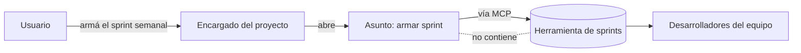

# ADR-0023 — Sprint y Asunto son ejes independientes, y el sprint vive en la herramienta que ve el equipo

- **Estado**: Aceptada
- **Fecha**: 2026-08-11

## Contexto

[ADR-0014](./0014-gestion-de-sprints-via-mcp.md) congeló el requisito y abrió
[`investigacion/gestion-de-sprints/`](../../investigacion/gestion-de-sprints/research.md)
con dos preguntas: dónde vive el estado de un sprint, y qué relación tiene un Sprint con
un Asunto. El relevamiento del 2026-08-11 encontró herramientas de sobra pero ninguna que
contestara eso — porque no es una pregunta de herramienta.

El Usuario describió el caso de uso concreto (2026-08-11): *"estoy en un proyecto de
piscinas y necesito armar el sprint semanal, se lo encargo al agente del proyecto, él usa
el MCP para el sprint y **cualquiera de mis desarrolladores lo ve**"*.

Esa última cláusula responde las dos preguntas de una vez.

## Decisión

- **El estado del sprint vive en la herramienta externa que el equipo ya mira.** No en
  `~/.jafne/` ni en el repo `encargado/`: el sprint tiene como destinatarios a
  **desarrolladores humanos**, que no van a abrir el estado operativo del Asistente ni el
  repo de documentación del Encargado. JAFNE es cliente de esa herramienta vía MCP
  (ADR-0014), no su dueño.
- **Sprint y Asunto son ejes independientes**, igual que `estado_asunto` y
  `estado_contenedor` en [ADR-0008](./0008-estado-de-asuntos-y-panel-web.md):
  - Un Asunto puede no pertenecer a ningún sprint (un bug urgente, una charla de diseño).
  - Un sprint contiene trabajo que no es un Asunto de JAFNE — tareas de personas.
  - Armar el sprint **es en sí mismo** el trabajo de un Asunto, no su contenedor.
- **El Encargado autogenera, avanza y finaliza sprints** a pedido del Usuario. Es una
  operación de nivel proyecto, coherente con que el Encargado sea quien cruza repos
  ([ADR-0007](./0007-jerarquia-de-directorios-de-jafne-implementado.md)).

## Alternativas descartadas

- **El sprint agrupa Asuntos de JAFNE:** descartado — obligaría a que todo el trabajo del
  equipo pasara por un Asunto para aparecer en el sprint, y el caso de uso incluye
  explícitamente a desarrolladores humanos que no usan JAFNE.
- **El estado del sprint en `~/.jafne/`:** descartado — es el estado local del Asistente,
  en una sola máquina, invisible para el equipo. Rompe el requisito de que lo vean los
  desarrolladores.
- **El estado del sprint versionado en el repo `encargado/`:** descartado — la bitácora
  de [ADR-0021](./0021-bitacora-de-cierre-en-el-repo-encargado.md) es registro de lo que
  pasó; un sprint es planificación viva que el equipo edita fuera de JAFNE. Un archivo en
  git no es un tablero.

## Consecuencias

- **La elección de herramienta pasa a ser reemplazable**, que era el objetivo: si el
  estado vive afuera y JAFNE es cliente, cambiar de herramienta es cambiar de MCP, no
  rediseñar el modelo. El criterio de elección deja de ser arquitectónico y pasa a ser
  práctico: **la que el equipo ya use**.
- El panel ([ADR-0013](./0013-panel-web-como-dashboard-visual.md)) puede mostrar el sprint
  como **contexto** al lado de los Asuntos, sin ser su fuente de verdad.
- Falta definir el vocabulario mínimo de sprint que JAFNE necesita para hablar con
  cualquier herramienta — Jira tiene *sprints* y Linear tiene *cycles*, y no son lo mismo
  (ver [`fuentes/01`](../../investigacion/gestion-de-sprints/fuentes/01_mcp-oficiales-atlassian-y-linear.md)).
- El acceso de red al MCP externo sigue abierto: un Workspace tiene la red restringida por
  proyecto ([ADR-0011](./0011-redes-y-puertos-de-workspace.md)), y falta decidir si habla
  el Encargado desde su Workspace o el Asistente desde afuera.
