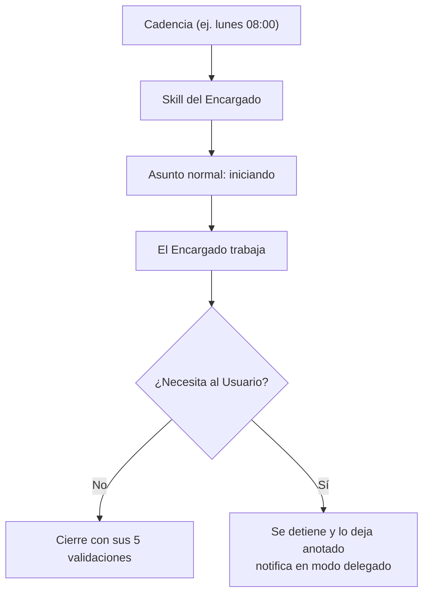

# ADR-0024 — Trabajo programado: Asuntos que se abren solos

- **Estado**: Aceptada
- **Fecha**: 2026-08-11

## Contexto

Hasta ahora **todo Asunto arrancaba porque el Usuario pedía algo**
([ADR-0006](./0006-asuntos-unidad-de-trabajo-y-ciclo-de-vida.md): "si el Usuario pide
delegar en un proyecto y no hay un Asunto abierto, se abre uno"). El requisito de sprints
rompe ese supuesto: el Usuario pidió que armar el sprint semanal sea *"algo automatizable
de forma semanal a través de un job en cron y una skill"* (2026-08-11).

Un sprint semanal automático es un Asunto que nadie abrió.

## Decisión

- **JAFNE soporta trabajo disparado por tiempo.** Un *trabajo programado* es una skill del
  Encargado + una cadencia; al dispararse **abre un Asunto normal**, con el mismo ciclo de
  vida, los mismos estados y el mismo cierre que uno pedido por el Usuario. No hay una
  segunda clase de Asunto.
- **El Usuario sigue siendo quien autoriza.** Programar un trabajo es una decisión del
  Usuario, igual que aprobar una capacidad
  ([ADR-0004](./0004-capacidades-por-repositorio.md)). El cron no crea autoridad nueva:
  ejecuta lo que el Usuario ya autorizó, con el alcance que autorizó.
- **Un Asunto programado no puede escalar al Usuario en tiempo real.** La cadena de
  escalación ([ADR-0002](./0002-jerarquia-de-roles-escalacion-y-modos-de-comunicacion.md))
  se mantiene, pero un trabajo que corre un domingo a las 3 AM no tiene a nadie del otro
  lado. Entonces: **si un Asunto programado necesita algo que solo el Usuario puede
  decidir, se detiene y lo deja anotado** — no adivina, y no se queda esperando indefinido
  consumiendo recursos.
- **El timeout de 3 minutos no aplica a un Asunto programado sin interlocutor.** El
  mecanismo de [ADR-0017](./0017-timeout-derivado-y-pregunta-pendiente.md) ya lo cubre sin
  cambios: `pregunta_pendiente` solo se sube cuando efectivamente se le preguntó algo al
  Usuario. Un trabajo nocturno que no pregunta nada nunca entra en
  `esperando_respuesta` — que es exactamente lo correcto.

## Alternativas descartadas

- **Una clase distinta de "trabajo automático", separada de los Asuntos:** descartada —
  duplicaría estados, cierre, historial y panel para algo que es lo mismo con otro
  disparador. El Asunto ya es la unidad de trabajo persistente (ADR-0006).
- **Que un Asunto programado espere indefinidamente a que el Usuario responda:**
  descartada — deja un Workspace consumiendo recursos durante días por una pregunta que
  nadie va a ver hasta el lunes.
- **Que un Asunto programado decida solo lo que normalmente escalaría:** descartada — la
  cadena de escalación no se relaja porque no haya nadie mirando; al contrario, es cuando
  más importa.
- **Poner el cron adentro de cada Workspace:** descartada — los Workspaces son efímeros
  (`arquitectura.md`, principio 2); un disparador tiene que sobrevivirlos.

## Consecuencias

- Un trabajo programado necesita **tres cosas**: la skill, la cadencia y a qué proyecto
  aplica. Dónde se declara eso queda por definir — `~/.jafne/` es el candidato natural
  porque es el estado cross-proyecto del Asistente (ADR-0007).
- **Quién corre el reloj queda abierto.** [ADR-0017](./0017-timeout-derivado-y-pregunta-pendiente.md)
  descartó un scheduler para el timeout porque ahí había una alternativa derivable; acá no
  la hay — una cadencia semanal exige que algo corra. Es la primera pieza de JAFNE que
  necesita un proceso de fondo de verdad.
- El panel debería mostrar qué trabajos hay programados y cuándo corren
  ([ADR-0013](./0013-panel-web-como-dashboard-visual.md)); no se diseña esa vista todavía.
- Se cruza con el cambio de proveedor por saldo
  ([ADR-0025](./0025-presupuesto-por-proveedor-y-conmutacion-por-saldo.md)): un trabajo
  nocturno que se topa con el límite de un proveedor no puede preguntarle al Usuario qué
  hacer.
