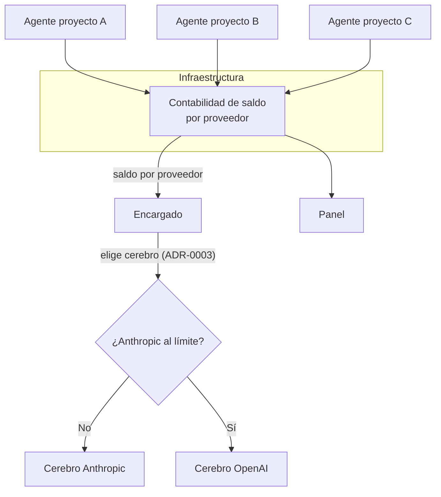

# ADR-0025 — Presupuesto por proveedor: el objetivo es el saldo, y quien cuenta es Infraestructura

- **Estado**: Aceptada
- **Fecha**: 2026-08-11

## Contexto

[ADR-0013](./0013-panel-web-como-dashboard-visual.md) pidió mostrar el uso de las
suscripciones de Anthropic y OpenAI, y dejó abierto de dónde sale el dato. El relevamiento
del 2026-08-11 ([`medicion-de-consumo/`](../../investigacion/medicion-de-consumo/research.md))
encontró que las APIs de uso y costo de los dos proveedores son **de organización y con
clave de administrador**, y no cubren cuentas individuales.

El Usuario precisó el requisito (2026-08-11) y lo movió de lugar:

1. Consume con **suscripciones personales**, no con una organización.
2. Lo que quiere ver no es gasto acumulado sino **cuánto uso le queda**.
3. Y quiere que sea **accionable**: *"si un Encargado ve que el uso de Anthropic está en
   el límite y muchos agentes están usando, que utilice OpenAI"*.
4. Propuso quién debería llevar la cuenta: *"capaz delegamos esto al que crea los
   contenedores con el agente, ya que tiene el estado de los otros agentes"*.

## Decisión

- **La métrica es el saldo, no el gasto.** JAFNE mide *cuánto queda* de cada suscripción
  antes del límite, no cuántos dólares se llevan gastados. El gasto acumulado es
  información de facturación; el saldo es información **operativa**, que es lo que un
  Encargado necesita para decidir.
- **Infraestructura lleva la contabilidad**, porque es el único componente con vista de
  todos los agentes a la vez: es quien crea los Workspaces y conoce el estado de cada uno
  ([ADR-0008](./0008-estado-de-asuntos-y-panel-web.md) ya le dio el eje del contenedor).
  Ningún Encargado puede saber solo cuánto están consumiendo los agentes de otro proyecto.
- **El saldo es una entrada de la decisión de cerebro.** El Encargado ya decide, tarea por
  tarea, qué cerebro y qué esfuerzo asignar
  ([ADR-0003](./0003-cerebro-por-rol-y-agnosticismo-de-proveedor.md)); esta decisión suma
  el saldo disponible por proveedor como una de las variables de esa elección. **Conmutar
  de proveedor cuando uno está cerca del límite es comportamiento esperado, no una
  degradación de emergencia** — es la misma política de ADR-0003 vista de otro lado:
  preferir seguir trabajando bien antes que quedarse trabado.
- **El saldo se lee del cliente del proveedor, no de una API de organización.** Es lo que
  hay disponible para una suscripción personal, y encaja con el agnosticismo de ADR-0003:
  leer el saldo es otro trabajo del adaptador por proveedor, junto a traducir `.agents/`,
  adjuntarse a una sesión y rehidratar contexto.

## Alternativas descartadas

- **Medir gasto en dólares en vez de saldo:** descartado por el requisito — con una
  suscripción de monto fijo mensual, el gasto ya está pagado y no informa nada; lo que
  cambia el comportamiento es cuánto queda de la ventana.
- **Las APIs de uso/costo de los proveedores como fuente principal:** descartadas para
  este caso — son de organización y con clave de administrador, y JAFNE consume con
  suscripciones personales. Siguen siendo válidas como reconciliación si algún día hay
  una organización detrás.
- **Que cada Encargado lleve su propia cuenta:** descartado — un Encargado ve solo sus
  agentes. El límite es del proveedor y se comparte entre todos los proyectos, así que la
  cuenta tiene que ser global o no sirve para decidir.
- **Que el Usuario declare a mano un presupuesto y JAFNE lo descuente a ciegas:**
  descartado como única fuente — se desincroniza en cuanto el Usuario usa el mismo plan
  por fuera de JAFNE, que es lo normal.
- **Bloquear el trabajo al llegar al límite:** descartado — el requisito es conmutar de
  proveedor, no frenar. Frenar es el último recurso, cuando no queda saldo en ninguno.

## Consecuencias

- **`cerebros.yaml` deja de ser una lista estática.** Hoy declara qué proveedores hay
  ([ADR-0007](./0007-jerarquia-de-directorios-de-jafne-implementado.md)); ahora cada
  entrada necesita además un saldo observado y su ventana de reset.
- **El adaptador de `.agents/` suma un cuarto trabajo**: leer el saldo del proveedor. Ya
  tenía traducir la configuración, adjuntarse a una sesión y rehidratar historial
  ([ADR-0018](./0018-reapertura-de-asuntos.md)).
- **Conmutar de proveedor a mitad de un Asunto tiene costo.** Cambiar de cerebro invalida
  el contexto cacheado y el Encargado y el Agente pueden quedar en proveedores distintos
  dentro del mismo Asunto. Falta definir si la conmutación aplica solo a tareas nuevas o
  también en el medio.
- **Cómo Infraestructura ve el consumo sigue abierto**, y es la pregunta que bloquea la
  implementación: el Broker crea los Workspaces, pero las llamadas al modelo las hacen los
  agentes adentro. O las llamadas pasan por un punto de paso que mide, o cada agente
  reporta lo suyo — y son dos arquitecturas distintas. Va a
  [`medicion-de-consumo/`](../../investigacion/medicion-de-consumo/research.md).
- Se cruza con [ADR-0024](./0024-trabajo-programado-asuntos-disparados-por-tiempo.md): un
  trabajo programado que se topa con el límite no puede consultar al Usuario, así que la
  conmutación automática es justamente lo que lo salva.
