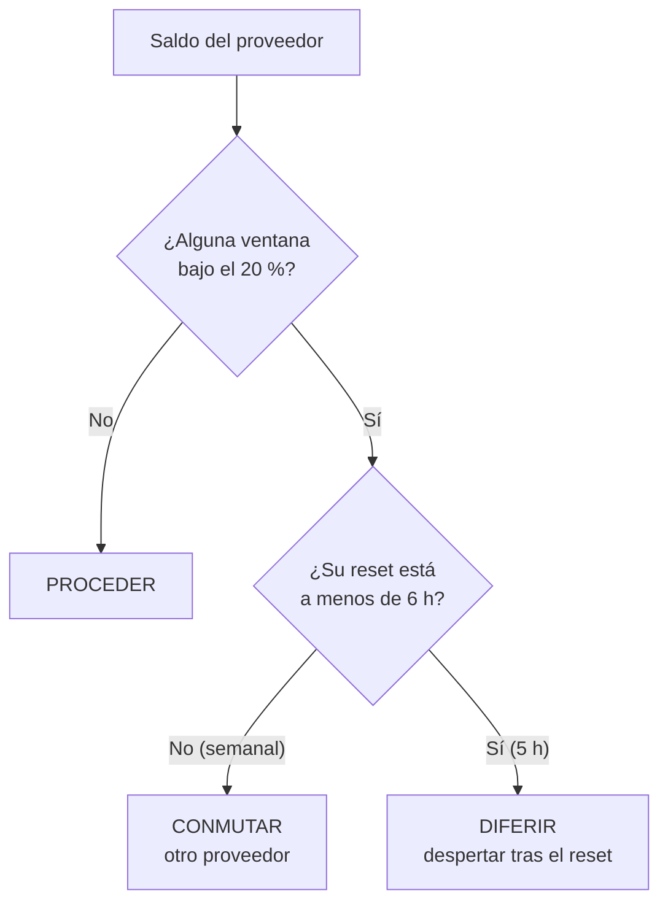

# ADR-0026 — Umbral de conmutación: la ventana larga conmuta, la corta difiere

- **Estado**: Aceptada
- **Fecha**: 2026-08-18

## Contexto

[ADR-0025](./0025-presupuesto-por-proveedor-y-conmutacion-por-saldo.md) decidió que la
métrica es el **saldo**, que Infraestructura lleva la cuenta y que conmutar de proveedor
es comportamiento esperado. Dejó explícitamente abiertas tres preguntas, que son las que
esta decisión cierra:

1. **Cuán cerca del límite** justifica conmutar.
2. **Cómo se combinan** la ventana de 5 h y la semanal en una sola señal — *"queda poco y
   resetea en 40 minutos"* y *"queda poco y resetea el lunes"* llevan a decisiones
   opuestas.
3. Si la conmutación aplica **solo a tareas nuevas** o también a mitad de un Asunto.

El código refleja hoy esa apertura: `Ventana.agotada` solo se anima a llamar escasez al
cero, y `Suscripcion` expone todas las ventanas sin colapsarlas, porque colapsarlas
hubiera sido elegir por el Encargado antes de tiempo.

Al plantear la pregunta 2 apareció una tercera salida que no estaba sobre la mesa. Las
opciones evaluadas eran conmutar o no conmutar; el Usuario señaló (2026-08-18) que una
ventana corta agotada no es un problema de proveedor sino de **momento**:

> *"la semanal manda; el de 5 h solamente se reprograma — si ve que se está quedando sin
> cupo de 5 h, se programa un demonio para que se despierte pasado el plazo"*

## Decisión

- **El umbral es el 20 % restante de una ventana.** Por debajo de eso, la ventana se
  considera cerca del límite. Es un número fijo, como los 3 minutos de
  [ADR-0017](./0017-timeout-derivado-y-pregunta-pendiente.md): un valor por configurar es
  un valor que nadie configura y que hace que dos JAFNE se comporten distinto.

- **Las dos ventanas no se colapsan en una señal: producen acciones distintas.** Lo que
  decide cuál se aplica no es el nombre de la ventana sino **su horizonte de reset**:

  | Situación | Acción |
  |---|---|
  | Ninguna ventana bajo el umbral | `PROCEDER` |
  | Ventana bajo el umbral y su reset está **lejos** | `CONMUTAR` |
  | Ventana bajo el umbral y su reset está **cerca** | `DIFERIR` hasta ese reset |

- **La frontera entre cerca y lejos es el horizonte de espera: 6 horas.** Está elegido
  para cubrir el peor caso de una ventana de 5 h. Se define por el horizonte y no por el
  nombre de la ventana para no clavar en el código el vocabulario de un proveedor: otro
  puede llamarlas distinto o tener tres.

- **`CONMUTAR` gana sobre `DIFERIR`.** Si las dos condiciones se dan a la vez, se conmuta:
  esperar no resuelve la ventana larga.

- **`DIFERIR` no cambia de cerebro: posterga el trabajo.** El Asunto queda parado y se
  programa un despertar para después del reset. Cambiar de proveedor invalida el contexto
  cacheado y puede dejar Encargado y Agente en proveedores distintos dentro del mismo
  Asunto; esperar 40 minutos no cuesta nada de eso. Es la política de
  [ADR-0003](./0003-cerebro-por-rol-y-agnosticismo-de-proveedor.md) —preferir seguir
  trabajando bien antes que rehacer— aplicada al tiempo en vez de a los tokens.

- **La conmutación aplica solo a Asuntos nuevos.** Un Asunto empezado se termina con el
  cerebro que lo empezó, aunque cueste más. La señal se consulta al elegir cerebro, no en
  el medio del trabajo.

- **La señal dice qué hacer, no con qué.** Elegir el cerebro de destino sigue siendo
  trabajo del Encargado (ADR-0003). Esta decisión aporta una variable más a esa elección,
  no la reemplaza.

- **Sin saldo observado se procede.** Una ventana sin dato no es una ventana en cero:
  desconocido no es escasez, y frenar por falta de observación sería peor que el problema
  que resuelve.

## Alternativas descartadas

- **Un único booleano "hay saldo" combinando las dos ventanas:** descartado — es
  justamente lo que ADR-0025 se negó a hacer, y con razón: colapsa dos situaciones que
  piden acciones opuestas. La ventana corta y la larga difieren en el horizonte, no en la
  cantidad.
- **Conmutar también cuando se agota la ventana corta:** descartado — es la opción que
  parecía obvia antes de mirar el costo. Paga la invalidación del contexto cacheado y el
  riesgo de partir un Asunto entre dos proveedores para ahorrar una espera que se resuelve
  sola en minutos.
- **Distinguir las ventanas por su nombre (`5h` vs `semanal`):** descartado — ata el
  núcleo al vocabulario de un proveedor. El horizonte de reset ya está en `saldo.yaml` y
  es un dato, no una convención.
- **Umbral configurable por el Usuario:** descartado por ahora, por la misma razón que el
  timeout de ADR-0017. Si aparece un caso real que necesite otro número, gradúa a un ADR
  que lo diga.
- **Conmutar a mitad de un Asunto:** descartado — el propio ADR-0025 anotó el costo.
  Queda como último recurso explícito si algún día no hay saldo en ningún proveedor, y
  entonces será otra decisión.
- **Frenar al llegar al límite:** ya descartado en ADR-0025. `DIFERIR` no es frenar: es
  frenar **con hora de reanudación**, que es lo que lo vuelve aceptable.

## Consecuencias

- **`DIFERIR` necesita quien lo despierte.** Es la primera funcionalidad que depende de
  un proceso de fondo, y por eso se apoya en
  [ADR-0024](./0024-trabajo-programado-asuntos-disparados-por-tiempo.md): el mismo reloj
  que dispara cadencias declaradas atiende ahora despertares **one-shot** que programa el
  propio sistema. Un solo mecanismo de cola, dos productores.

- **La hora de despertar no es una estimación: ya está guardada.** `saldo.yaml` registra
  `resetea` por ventana desde ADR-0025, así que el diferimiento no agrega ningún campo.

- **Pero el saldo tiene que estar fresco**, y quien lo reporta es el adaptador del
  proveedor (cuarto trabajo del adaptador, ADR-0025). Mientras el saldo se cargue a mano,
  la señal es correcta pero opera sobre datos viejos. **`DIFERIR` no se puede implementar
  de verdad antes que el adaptador.**

- **No hace falta un estado nuevo de Asunto.** Un Asunto esperando cupo es
  `interactuando_con_el_usuario` en el eje del Encargado y `suspendido` en el del
  contenedor —*"el Workspace existe pero no consume cómputo"*—, que es exactamente lo que
  pasa. Los catálogos cerrados de [ADR-0009](./0009-catalogo-cerrado-estado-asunto.md) y
  [ADR-0016](./0016-catalogo-cerrado-estado-contenedor.md) quedan intactos, y la
  combinación es de las que [ADR-0008](./0008-estado-de-asuntos-y-panel-web.md) declaró
  normales.

- **"Esperando cupo" se deriva al leer, no se persiste.** Sale del saldo y su reset, igual
  que el timeout de ADR-0017 sale de `pregunta_pendiente` y la hora del último mensaje. El
  panel lo muestra; nadie lo escribe.

- **`CONMUTAR` puede no tener a dónde ir.** Con un solo adaptador implementado
  ([ADR-0028](./0028-anthropic-primero-alcance-de-adaptadores.md)) la señal es correcta
  pero no accionable. El Encargado tiene que tratarla como lo que es —una recomendación
  sin destino disponible— y no como una orden que no puede cumplir.

- **La señal es una función pura y por lo tanto testeable sola**, sin saldo real ni
  proveedor: entra una `Suscripcion` y un instante, sale una de tres constantes.
