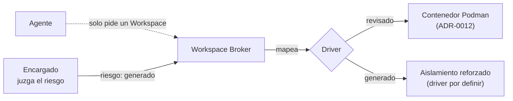

# ADR-0027 — El Encargado declara una clase de riesgo; Infraestructura la mapea a driver

- **Estado**: Reemplazada por [ADR-0045](./0045-para-que-existen-los-contenedores.md)
- **Fecha**: 2026-08-18

## Contexto

[ADR-0012](./0012-motor-de-contenedores-podman.md) fijó Podman como motor por defecto y
[ADR-0011](./0011-redes-y-puertos-de-workspace.md) el aislamiento de red por proyecto. La
investigación de orquestación
([`aislamiento-de-workspaces.md`](../../investigacion/orquestacion-entornos/analisis/aislamiento-de-workspaces.md))
encontró después que **un contenedor plano no alcanza cuando un Agente ejecuta código que
un modelo acaba de escribir**, y dejó el nivel de aislamiento como un parámetro por tarea
en vez de una decisión única para todo JAFNE.

Eso abrió la pregunta que esta decisión cierra: **quién completa ese parámetro**, sin
romper el principio 1 de la arquitectura —*agentes agnósticos de infraestructura*—. La
comparación de las cuatro opciones está en
[`quien-decide-el-aislamiento.md`](../../investigacion/orquestacion-entornos/analisis/quien-decide-el-aislamiento.md).

## Decisión

- **El Encargado declara una clase de riesgo. Infraestructura la traduce a driver.** El
  Encargado habla de algo que entiende —¿este código lo revisó un humano, o lo acaba de
  escribir un modelo?— y nunca de tecnología de virtualización.

- **El catálogo es cerrado y tiene dos valores.** Un catálogo chico se puede razonar y
  auditar; agregar un valor requiere un ADR que reemplace a este, igual que en
  [ADR-0009](./0009-catalogo-cerrado-estado-asunto.md) y
  [ADR-0016](./0016-catalogo-cerrado-estado-contenedor.md):

  | Clase | Cuándo | Ejemplos |
  |---|---|---|
  | `revisado` | El código pasó por revisión humana o ya está commiteado en el repo | Correr tests conocidos, buildear, levantar los servicios del proyecto |
  | `generado` | El Agente va a ejecutar código que un modelo acaba de escribir, sin revisar | Probar una implementación recién generada |

- **`generado` es el default.** Ante la duda, la clase más estricta. Es el análogo exacto
  de la política de [ADR-0003](./0003-cerebro-por-rol-y-agnosticismo-de-proveedor.md):
  ahí se elige gastar de más antes que arriesgar re-trabajo; acá se elige **aislar de más
  antes que arriesgar un escape**.

- **La clase viaja en el pedido de Workspace, no en `engineering.yaml`.** El riesgo es una
  propiedad de **la tarea**, no del repositorio: el mismo repo tiene tareas de las dos
  clases el mismo día.

- **El mapeo clase → driver pertenece a Infraestructura**, que es donde ya vive la
  elección de motor (ADR-0012). Cambiarlo no obliga a reeducar a ningún Encargado.

## Alternativas descartadas

- **Que lo pida el Agente:** descartada por romper el principio 1 — el Agente tendría que
  conocer microVM y gVisor, que es exactamente la tecnología que el diseño le oculta.
  Además le pide a quien ejecuta el código no confiable que se autoevalúe el riesgo.
- **Que el Encargado pida tecnología ("quiero una microVM"):** descartada — el Encargado
  sí puede juzgar el riesgo, pero obligarlo a nombrar la tecnología reintroduce el acople
  que ADR-0012 mantiene detrás del contrato del Broker. Si mañana entra otro driver, hay
  que reeducar a todos los Encargados.
- **Una tabla fija por tipo de tarea en Infraestructura** ("tests → contenedor, build →
  contenedor, ejecutar código nuevo → microVM"): descartada — es determinista y auditable,
  pero obliga a enumerar por adelantado los tipos de tarea, y una tarea que no encaja cae
  en el caso por defecto sin que nadie se entere.
- **Cinco clases de riesgo en vez de dos:** descartada — un catálogo que nadie puede
  recitar se completa a ojo, y una clase que se elige a ojo no es una garantía.

## Consecuencias

- **JAFNE tiene un tercer catálogo cerrado**, y las mismas reglas que los otros dos: un
  valor fuera del catálogo se rechaza al leer, y agregar uno es un ADR.

- **El default necesita un driver que ADR-0012 todavía no provee.** Podman cubre
  `revisado`; `generado` —que es el default— pide algo más fuerte. Esto **no** reemplaza a
  ADR-0012: lo acota a una de las dos clases. Cuál driver concreto sirve a `generado`, y
  sobre todo si conviene operar dos drivers a la vez, es la pregunta de costo real y sigue
  abierta en
  [`orquestacion-entornos`](../../investigacion/orquestacion-entornos/research.md).
  Mientras no se resuelva, un Broker que solo sepa Podman tiene que **rechazar** un pedido
  `generado` en vez de servirlo con menos aislamiento del declarado: servir de menos en
  silencio es peor que no servir.

- **Se puede escribir el contrato del Broker sin haber elegido el driver.** El pedido
  —`{riesgo} → {workspace, estado, url}`— queda cerrado con esta decisión, y es lo que las
  validaciones 4 y 5 del cierre ([ADR-0019](./0019-validaciones-del-cierre-de-asunto.md))
  necesitan para dejar de pasar vacuosamente.

- **Falta quién audita que el Encargado no marque todo como `revisado`** para ir más
  rápido. Se cruza con la cadena de aprobación de
  [ADR-0004](./0004-capacidades-por-repositorio.md) y queda abierto.

- **Sobre-aislar cuesta complejidad operativa, no latencia.** Firecracker arranca en
  ~125 ms, así que el precio de equivocarse hacia arriba no se paga en el reloj: se paga
  en tener dos drivers que mantener.

- **Queda abierto si dos clases alcanzan.** El candidato a tercera es "código de terceros
  o dependencias nuevas", que hoy cae en `generado` por default — que es el lado seguro
  del error.
