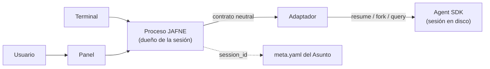

# ADR-0031 — El contrato de sesión es reanudable, no adjuntable, y el proceso es de JAFNE

- **Estado**: Aceptada
- **Fecha**: 2026-08-18

## Contexto

La decisión sobre la propiedad del proceso del agente (2026-08-18) eligió un **contrato
neutral de sesión** con un adaptador por proveedor debajo, siguiendo el lean de
[`hops-de-comunicacion.md`](../../investigacion/protocolo-de-asignacion-de-tareas/analisis/hops-de-comunicacion.md):
*"B donde el proveedor lo ofrezca, A como fallback"*, donde B era **adjuntarse a una
sesión viva** del proveedor y A era que JAFNE fuera dueño del proceso y multiplexara su
E/S. Ese análisis dejó una pregunta marcada como **sin relevar**: si Claude Code y la
familia OpenAI ofrecen hoy un modo sesión adjuntable.

El relevamiento se hizo el 2026-08-18 contra la documentación del **Claude Agent SDK**
(`code.claude.com/docs/en/agent-sdk`), y el resultado no es el que el lean asumía.

**Las sesiones existen, pero son reanudables — no adjuntables.** Una sesión es el
historial de conversación que el SDK escribe a disco
(`~/.claude/projects/<cwd>/<id>.jsonl`); se vuelve a ella pasando su id a `resume`, o se
bifurca con `fork_session`. Lo que **no** hay es una primitiva para que un segundo
observador se enganche a un turno en curso. La API experimental que ofrecía justamente eso
—`createSession()` con `send`/`stream`— **fue removida** en la versión 0.3.142 del SDK de
TypeScript.

Lo que sí ofrece, y es mucho: un cliente multi-turno en proceso (`ClaudeSDKClient`),
`resume` por id que sobrevive al reinicio del proceso, `fork_session`, enumeración y
metadatos (`list_sessions`, `get_session_messages`, `get_session_info`, `rename_session`,
`tag_session`), un `SessionStore` para reanudar entre máquinas, y en cada resultado el
`session_id` y el `total_cost_usd` del turno.

## Decisión

- **El contrato neutral es de sesión reanudable.** Cuatro operaciones, que son los cuatro
  trabajos que ADR-0025 ya le había adjudicado al adaptador:

  | Operación | Qué hace |
  |---|---|
  | `abrir(proyecto, tamaño)` | Arranca una sesión nueva y devuelve su id |
  | `reanudar(id)` | Vuelve a una sesión con su contexto entero |
  | `emitir(mensaje)` | Manda un turno y devuelve un flujo de eventos estructurados |
  | `saldo()` | Lo que el cliente del proveedor sepa decir sobre consumo |

- **JAFNE es dueño del proceso del agente.** Cae del lado de la opción A del análisis —
  pero **sin su desventaja**: el SDK entrega mensajes estructurados, no salida pensada para
  una terminal. El único argumento que había contra A era el parseo frágil de texto y la
  pérdida del estado estructurado, y con el SDK ese argumento desaparece.

- **El panel se adjunta a JAFNE, no al proveedor.** Multiplexar varios observadores sobre
  una misma sesión es trabajo de JAFNE, y ahora se sabe que **tiene que serlo**: ningún
  proveedor lo ofrece. Esto es lo que finalmente resuelve el hop 2 y confirma por qué el
  hop 2 y el hop 3 colapsan en el mismo mecanismo.

- **El id de sesión del proveedor se guarda en el `meta.yaml` del Asunto.** Es el dato que
  vuelve ejecutable la rehidratación que
  [ADR-0018](./0018-reapertura-de-asuntos.md) pidió sin tener con qué.

- **Rehidratar es reanudar, no reinyectar.** Si el proveedor sabe volver a su propia
  sesión, JAFNE le pasa el id y no le vuelve a contar la conversación. Reinyectar el
  `historial.jsonl` queda como **piso** para un proveedor que no tenga `resume`.

## Alternativas descartadas

- **Esperar un modo adjuntable del proveedor (la opción B del lean):** descartada porque
  **no existe**, y el intento previo del propio proveedor se retiró. Diseñar contra una
  primitiva que fue removida es diseñar contra algo que ya se probó y se dio de baja.
- **Que JAFNE reimplemente el bucle de agente (opción C):** sigue descartada por
  [ADR-0003](./0003-cerebro-por-rol-y-agnosticismo-de-proveedor.md) — ser agnóstico es
  *configurar* el cerebro, no reconstruir el agente.
- **Multiplexar la CLI con `-p --output-format json`:** descartada como camino principal.
  Es la salida que el propio proveedor recomienda para lenguajes sin SDK, y JAFNE es
  Python, que sí lo tiene. Queda como piso genérico, que es exactamente el rol que
  [ADR-0028](./0028-anthropic-primero-alcance-de-adaptadores.md) le reserva.
- **Guardar el historial solo del lado de JAFNE e ignorar la sesión del proveedor:**
  descartada — funciona, pero tira el contexto que el proveedor ya tiene cargado y paga de
  nuevo la reconstrucción en cada reapertura.

## Consecuencias

- **⚠️ Los términos del Agent SDK chocan con ADR-0025.** La documentación dice que
  Anthropic **no permite** a desarrolladores terceros ofrecer login de claude.ai ni los
  límites de uso de esas cuentas en sus productos —incluidos los agentes construidos sobre
  el Agent SDK— y que hay que usar autenticación por **API key**.
  [ADR-0025](./0025-presupuesto-por-proveedor-y-conmutacion-por-saldo.md) eligió
  suscripciones personales. Para una herramienta que usa su propio autor sobre su propia
  cuenta la lectura es discutible; **para el JAFNE que "cualquiera de mis desarrolladores
  ve" (ADR-0023), no lo es.** Esto no invalida ADR-0025 hoy, pero es la clase de detalle
  que invalida un diseño en silencio, y queda anotado para decidirlo antes de que JAFNE
  deje de ser personal.

- **El saldo sigue sin resolverse; lo que aparece es el gasto.** El SDK expone
  `total_cost_usd` por turno, que es **gasto**, y ADR-0025 eligió medir **saldo**. Es un
  dato bueno y nuevo —permite atribuir costo por Asunto— pero no cierra
  `medicion-de-consumo`: acota la pregunta a *cuánto queda*, que sigue viniendo del cliente
  del proveedor.

- **`historial-desbordado` cambia de dueño.** Si la rehidratación es `resume`, quien
  administra la ventana de contexto es el propio proveedor con su compactación, no JAFNE.
  El pendiente sigue abierto, pero solo para el piso que reinyecta.

- **Las sesiones viven en la máquina que las creó**, salvo que se enchufe un `SessionStore`.
  Eso le suma una consecuencia concreta a `sincronia-entre-maquinas`: no es solo el estado
  operativo de `~/.jafne/`, también el transcript del proveedor.

- **El contrato tiene una sola implementación**, con el riesgo que ADR-0028 ya declaró: es
  una hipótesis hasta que exista la segunda. La regla de validación de ese ADR —poder
  contestar cómo lo haría el piso genérico sobre CLI— se cumple para las cuatro
  operaciones, porque la CLI expone `-p`, `--resume` y `--output-format json`.

- **El panel deja de esperar al proveedor.** `chat-asistente` y `chat-encargado` dejan de
  estar bloqueados por una pregunta de diseño y pasan a ser trabajo: multiplexar el
  proceso que JAFNE ya va a ser dueño.
