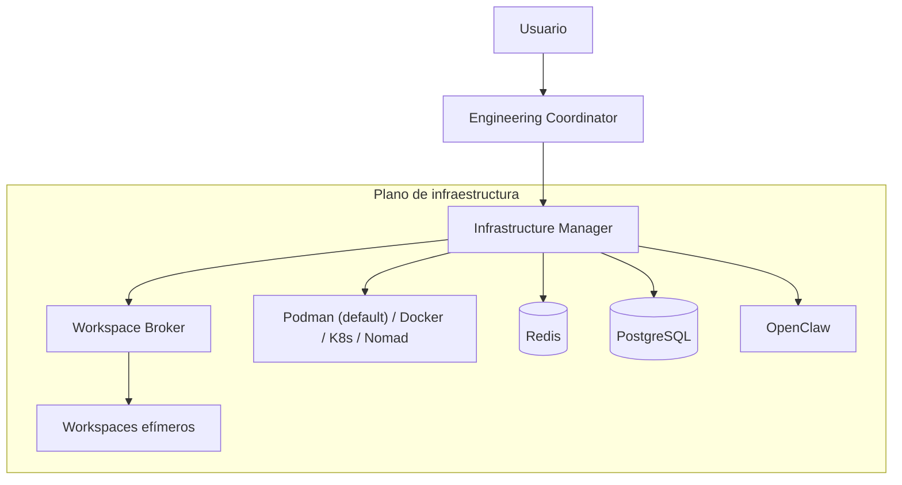
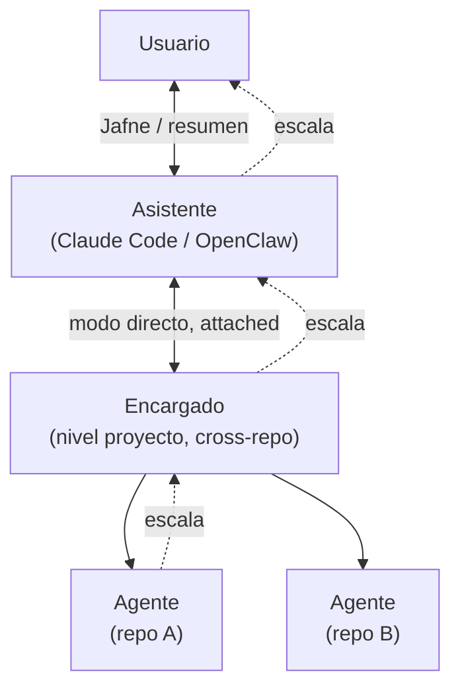

---
fuentes:
  - investigacion/orquestacion-entornos/research.md
  - investigacion/orquestacion-entornos/fuentes/01_engineering-os-v0.2.md
  - docs/adr/0002-jerarquia-de-roles-escalacion-y-modos-de-comunicacion.md
  - docs/adr/0003-cerebro-por-rol-y-agnosticismo-de-proveedor.md
  - docs/adr/0004-capacidades-por-repositorio.md
  - docs/adr/0011-redes-y-puertos-de-workspace.md
  - docs/adr/0012-motor-de-contenedores-podman.md
  - docs/adr/0013-panel-web-como-dashboard-visual.md
  - docs/adr/0014-gestion-de-sprints-via-mcp.md
  - docs/adr/0015-stack-inicial-de-implementacion.md
  - docs/adr/0016-catalogo-cerrado-estado-contenedor.md
  - docs/adr/0017-timeout-derivado-y-pregunta-pendiente.md
  - docs/adr/0018-reapertura-de-asuntos.md
  - docs/adr/0019-validaciones-del-cierre-de-asunto.md
  - docs/adr/0020-hosting-y-autenticacion-del-panel.md
  - docs/adr/0021-bitacora-de-cierre-en-el-repo-encargado.md
  - docs/adr/0022-orden-de-la-familia-openai.md
  - docs/adr/0023-sprints-ejes-independientes-y-estado-externo.md
  - docs/adr/0024-trabajo-programado-asuntos-disparados-por-tiempo.md
  - docs/adr/0025-presupuesto-por-proveedor-y-conmutacion-por-saldo.md
  - docs/adr/0026-umbral-de-conmutacion-y-diferimiento-por-ventana-corta.md
  - docs/adr/0027-clase-de-riesgo-declarada-por-el-encargado.md
  - docs/adr/0028-anthropic-primero-alcance-de-adaptadores.md
  - docs/adr/0029-el-reloj-corre-en-el-proceso-del-panel.md
  - docs/adr/0035-el-reloj-corre-en-su-propio-proceso.md
  - docs/adr/0036-dictado-por-voz-con-whisper-local.md
  - docs/adr/0030-tamanos-de-cerebro-catalogo-comun-entre-proveedores.md
  - docs/adr/0031-contrato-de-sesion-reanudable.md
  - docs/adr/0032-driver-de-la-clase-generado.md
  - docs/adr/0033-tamano-por-defecto-del-rol-asistente.md
verificado: 2026-08-19
---

# Arquitectura de JAFNE (vista aceptada)

> Solo lo **congelado**. Las preguntas abiertas y las opciones en evaluación están en
> [`investigacion/`](../investigacion/). Este documento se actualiza cuando una
> investigación gradúa a una decisión, o cuando un requisito se congela directo como ADR
> ([ADR-0005](./adr/0005-cuando-investigar-vs-adr-directo.md)).

> **Este documento es la vista narrativa: por qué el sistema tiene la forma que tiene.**
> Para responder rápido *qué es verdad hoy* sobre un tema puntual —una fila por tema,
> citando su ADR— está [`estado-del-diseno.md`](./estado-del-diseno.md). Uno es el mapa,
> el otro el índice; los dos derivan de [`docs/adr/`](./adr/README.md).

## Premisa

JAFNE orquesta **dos planos** a la vez:

- **Plano de agentes** — quién hace cada tarea de ingeniería (diseñar, codear, testear,
  documentar, revisar, desplegar).
- **Plano de infraestructura** — dónde y cómo se ejecuta cada tarea (entornos aislados
  y efímeros).

Ambos planos están **desacoplados**: los agentes piden capacidades y la infraestructura
resuelve el cómo.

## Diagrama

## Jerarquía de roles y escalación

Ver [ADR-0002](./adr/0002-jerarquia-de-roles-escalacion-y-modos-de-comunicacion.md) para
el detalle completo.

- **Escalación estricta, sin saltar capas:** Agente → Encargado → Asistente → Usuario.
- **Dos modos de comunicación** Usuario ↔ Encargado: **directo** (attached, sin resumen)
  y **delegado** (async, con resumen del Asistente que preserva la voz del Encargado).
- **Palabra clave "Jafne"** invoca al Asistente y media el cambio a modo directo.

## Principios aceptados

1. **Agentes agnósticos de infraestructura.** Solo conocen el concepto de *Workspace*;
   la tecnología de virtualización queda oculta.
2. **Efímero por defecto.** Cada tarea corre en un workspace aislado que luego se
   destruye, suspende o snapshotea.
3. **Declarativo por repositorio.** Cada proyecto describe su entorno en
   `engineering.yaml`, sus capacidades (skills + MCP) y su cerebro en `.agents/` (ver
   [ADR-0003](./adr/0003-cerebro-por-rol-y-agnosticismo-de-proveedor.md) y
   [ADR-0004](./adr/0004-capacidades-por-repositorio.md)).
4. **Distribuible sin fricción.** La ejecución puede moverse entre nodos (GPU, build,
   laboratorio de hardware) vía ZeroTier sin cambiar el comportamiento de los agentes.
5. **Agnóstico de proveedor de IA.** Qué cerebro (proveedor + modelo) ejecuta cada rol es
   configuración, no un supuesto de diseño ([ADR-0003](./adr/0003-cerebro-por-rol-y-agnosticismo-de-proveedor.md)).
6. **Más tokens antes que rehacer.** Ante la duda, el Encargado sobre-asigna cerebro/
   esfuerzo en vez de arriesgar un re-trabajo ([ADR-0003](./adr/0003-cerebro-por-rol-y-agnosticismo-de-proveedor.md)).
7. **Capacidades versionadas por repo.** Las skills/MCP de un Agente viven en su repo y
   se publican vía GitHub; agregar una capacidad nueva siempre requiere aprobación humana
   ([ADR-0004](./adr/0004-capacidades-por-repositorio.md)).
8. **Asuntos como unidad de trabajo persistente**, con contenedor y ciclo de vida propio,
   independiente del chat ([ADR-0006](./adr/0006-asuntos-unidad-de-trabajo-y-ciclo-de-vida.md)).
9. **Un repo `encargado/` por proyecto** (Casa Justina + ADR juntos, misma forma que el
   propio repo `jafne`), y `~/.jafne/` como estado local del Asistente y fuente de verdad
   de los Asuntos ([ADR-0007](./adr/0007-jerarquia-de-directorios-de-jafne-implementado.md)).
10. **Estado de Asunto y de contenedor son ejes independientes**, y el Asistente puede
    leer el estado de todos los Encargados/Asuntos; un panel web de observabilidad
    consume esa misma fuente ([ADR-0008](./adr/0008-estado-de-asuntos-y-panel-web.md)).
11. **Podman es el motor de contenedores por defecto** para implementar Workspaces
    ([ADR-0012](./adr/0012-motor-de-contenedores-podman.md)); el Workspace es responsable
    de la red y los puertos — aislamiento entre proyectos, comunicación abierta
    intra-proyecto, exposición vía ZeroTier — no el Agente ni el Encargado
    ([ADR-0011](./adr/0011-redes-y-puertos-de-workspace.md)). Los contenedores se
    comitean versionados dentro de cada repo.
12. **El panel web es el punto de entrada gráfico**, no solo observabilidad: lista
    proyectos, permite chatear con el Asistente y —al entrar a un proyecto— con su
    Encargado, y muestra el uso de las suscripciones de Anthropic y OpenAI
    ([ADR-0013](./adr/0013-panel-web-como-dashboard-visual.md)). El **estado** de Asuntos
    y contenedores lo sigue viendo en solo lectura. Ese chat se puede **dictar**, con
    transcripción local: el audio no sale de la máquina ni se persiste, y transcribir no
    es escribir estado ([ADR-0036](./adr/0036-dictado-por-voz-con-whisper-local.md)).
13. **Planificar es trabajo regular.** El Encargado puede crear sprints en medio de una
    tarea, consumiendo la gestión de sprints como capacidad MCP
    ([ADR-0014](./adr/0014-gestion-de-sprints-via-mcp.md)).
14. **El contexto es del Asunto; el contenedor es del Workspace.** Un Asunto conserva su
    historial de conversación a través de todos los contenedores por los que pase, y al
    reabrirlo vuelve el contexto —no el contenedor, que se pide nuevo
    ([ADR-0018](./adr/0018-reapertura-de-asuntos.md)).
15. **El cierre es un punto de control con catálogo cerrado**, de cinco validaciones y
    todo-o-nada ([ADR-0019](./adr/0019-validaciones-del-cierre-de-asunto.md)); deja un
    rastro durable versionado en el repo `encargado/` del proyecto, así que perder
    `~/.jafne/` cuesta estado operativo, no memoria
    ([ADR-0021](./adr/0021-bitacora-de-cierre-en-el-repo-encargado.md)).
16. **Lo que se puede derivar no se persiste.** El timeout de 3 minutos se calcula al
    leer en vez de escribirse por un scheduler, así no puede desincronizarse
    ([ADR-0017](./adr/0017-timeout-derivado-y-pregunta-pendiente.md)).
17. **El panel nunca escucha en todas las interfaces**: loopback o la interfaz ZeroTier,
    y fuera de loopback exige token
    ([ADR-0020](./adr/0020-hosting-y-autenticacion-del-panel.md)).
18. **Sprint y Asunto son ejes independientes**, y el sprint vive en la herramienta que el
    equipo ya mira — su destinatario es humano
    ([ADR-0023](./adr/0023-sprints-ejes-independientes-y-estado-externo.md)).
19. **No todo Asunto lo abre el Usuario.** Un trabajo programado (skill + cadencia) abre
    un Asunto normal; si necesita algo que solo el Usuario puede decidir, se detiene y lo
    deja anotado en vez de adivinar o esperar indefinido
    ([ADR-0024](./adr/0024-trabajo-programado-asuntos-disparados-por-tiempo.md)).
20. **El saldo por proveedor es una variable de la decisión de cerebro.** Infraestructura
    lleva la cuenta —es la única con vista de todos los agentes— y el Encargado conmuta de
    proveedor cuando uno se acerca al límite; conmutar es comportamiento esperado, no
    degradación ([ADR-0025](./adr/0025-presupuesto-por-proveedor-y-conmutacion-por-saldo.md)).
21. **Una ventana escasa que resetea pronto se espera; una que resetea lejos hace
    conmutar.** No se colapsan en un booleano porque producen acciones distintas, y lo que
    las clasifica es el horizonte de reset y no el nombre que les puso el proveedor
    ([ADR-0026](./adr/0026-umbral-de-conmutacion-y-diferimiento-por-ventana-corta.md)).
22. **El Encargado declara riesgo, no tecnología.** Dice si el código está `revisado` o
    recién `generado` —y ante la duda, lo segundo—; traducir eso a un driver de aislamiento
    es trabajo de Infraestructura, que es la única que conoce el motor
    ([ADR-0027](./adr/0027-clase-de-riesgo-declarada-por-el-encargado.md)).
23. **Los cerebros se piden por tamaño, no por modelo.** `chico` / `medio` / `grande` /
    `gigante` es un catálogo común que cruza proveedores, así que el Encargado elige
    capacidad sin nombrar un modelo y la conmutación sabe qué es equivalente del otro lado
    ([ADR-0030](./adr/0030-tamanos-de-cerebro-catalogo-comun-entre-proveedores.md)).
24. **El proceso del agente es de JAFNE, y el panel se adjunta a JAFNE.** Las sesiones de
    los proveedores son reanudables, no adjuntables: se vuelve a ellas por id, no se
    engancha un observador a un turno vivo. Multiplexar observadores no lo resuelve
    ningún proveedor, así que lo resuelve el nivel de arriba
    ([ADR-0031](./adr/0031-contrato-de-sesion-reanudable.md)).
25. **El límite de aislamiento no puede vivir donde el agente razona.** Por eso la clase
    `generado` corre en microVM y no en un contenedor reforzado — y como es un runtime OCI
    del mismo Podman, no cuesta un segundo stack
    ([ADR-0032](./adr/0032-driver-de-la-clase-generado.md)).
26. **El reloj es un proceso propio, y el observador no escribe.** El trabajo programado
    necesita algo despierto —una cadencia semanal no se puede derivar al leer—, pero eso
    no lo convierte en tarea del dashboard: el reloj corre aparte, con una sola cola de
    despertares y dos productores, y el panel vuelve a ser de solo lectura sobre el
    estado, sin excepciones
    ([ADR-0035](./adr/0035-el-reloj-corre-en-su-propio-proceso.md)).

## Implementación

El código arranca el 2026-08-11 en `src/jafne/` (Python + FastAPI, panel estático sin
build — [ADR-0015](./adr/0015-stack-inicial-de-implementacion.md)), bajo la regla de que
**lo que no está decidido no se programa**. Qué está implementado y qué está bloqueado por
una decisión abierta: [`estado-de-implementacion.md`](./estado-de-implementacion.md).

## Qué NO está congelado todavía

Estas preguntas se resuelven en `investigacion/` antes de graduar a un ADR:

- Protocolo concreto de asignación de tareas Encargado → Agente (formato, contexto que se
  pasa) — los roles y la cadena de escalación ya están definidos en ADR-0002.
- Reparto de estado entre Redis y PostgreSQL.
- Rol de OpenClaw dentro del sistema, y si "Asistente" es OpenClaw o lo envuelve.
- Ciclo de vida completo de una tarea, de extremo a extremo.
- Scheduling multi-nodo (GPU/build/lab): lean hacia Nomad, sin confirmar
  (ver [desacople-de-virtualizacion](../investigacion/orquestacion-entornos/analisis/desacople-de-virtualizacion.md)).
- ~~Nivel de aislamiento de un Workspace~~ — **cerrado**: ADR-0027 fijó quién lo declara
  y ADR-0032 a qué runtime mapea cada clase. Resultó no costar dos stacks: son dos
  runtimes OCI del mismo Podman.
- Manejo de secretos (el aislamiento de red entre proyectos ya está resuelto en
  ADR-0011).
- ~~Quién es dueño del proceso del agente, y el diseño del adaptador~~ — **cerrado por
  ADR-0031**: el proceso es de JAFNE, el contrato tiene cuatro operaciones y las sesiones
  del proveedor son reanudables, no adjuntables.
- Comportamiento con **múltiples Encargados activos** a la vez y qué pasa si la sesión
  directa se corta sin decir "Jafne".
- Qué hacer cuando el historial de un Asunto reabierto no entra en la ventana de contexto
  del cerebro que lo retoma (ADR-0018).
- Sincronía de `~/.jafne/` entre máquinas — la *pérdida* de la memoria durable ya está
  resuelta por la bitácora de ADR-0021; la sincronía entre dos máquinas del mismo Usuario
  no.
- TLS propio del panel y rotación de su token (ADR-0020).
- **Cómo Infraestructura ve el consumo** de los agentes: o las llamadas al modelo pasan
  por un punto que mide, o cada agente reporta lo suyo — dos arquitecturas distintas. Es
  lo que bloquea ADR-0025 (ver
  [medicion-de-consumo](../investigacion/medicion-de-consumo/research.md)).
- Si el saldo de un proveedor se puede leer programáticamente, y cómo se combinan dos
  ventanas de reset distintas en una sola señal (ADR-0025).
- Si la conmutación de proveedor aplica a mitad de un Asunto o solo a tareas nuevas
  (ADR-0025).
- Herramienta concreta de gestión de sprints y el vocabulario mínimo para hablar con
  cualquiera de ellas — el modelo ya está decidido en ADR-0023, así que esto pasó de
  decisión arquitectónica a elección práctica (ver
  [gestion-de-sprints](../investigacion/gestion-de-sprints/research.md)).

> El 2026-08-11 salieron de esta lista siete preguntas de una vez (ADR-0016 a ADR-0022):
> catálogo de `estado_contenedor`, mecanismo del timeout, reapertura de Asuntos,
> validaciones del cierre, hosting y autenticación del panel, pérdida de `~/.jafne/`, y
> el orden de tier de la familia OpenAI.
