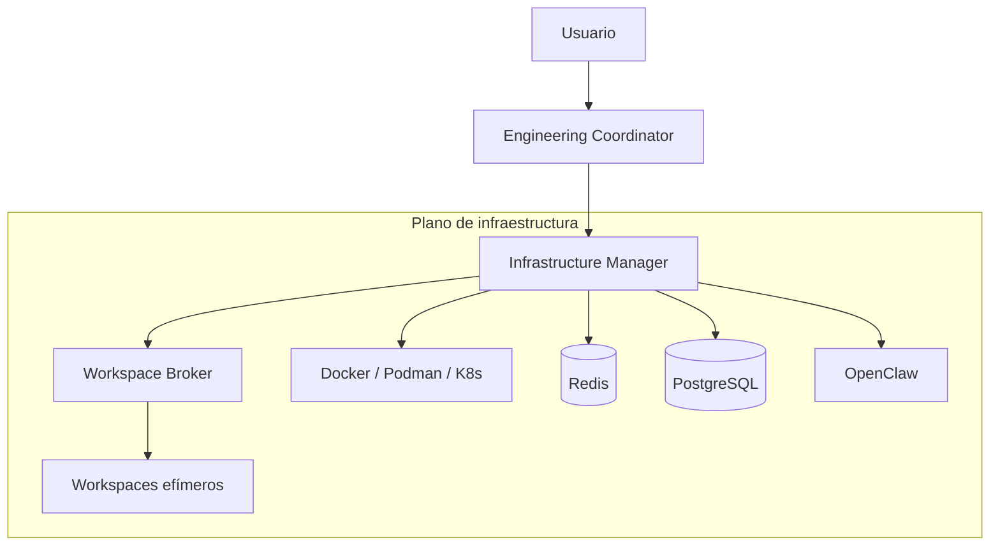

---
fuentes:
  - investigacion/orquestacion-entornos/research.md
  - investigacion/orquestacion-entornos/fuentes/01_engineering-os-v0.2.md
verificado: 2026-07-23
---

# Arquitectura de JAFNE (vista aceptada)

> Solo lo **congelado**. Las preguntas abiertas y las opciones en evaluación están en
> [`investigacion/`](../investigacion/). Este documento se actualiza cuando una
> investigación gradúa a una decisión.

## Premisa

JAFNE orquesta **dos planos** a la vez:

- **Plano de agentes** — quién hace cada tarea de ingeniería (diseñar, codear, testear,
  documentar, revisar, desplegar).
- **Plano de infraestructura** — dónde y cómo se ejecuta cada tarea (entornos aislados
  y efímeros).

Ambos planos están **desacoplados**: los agentes piden capacidades y la infraestructura
resuelve el cómo.

## Diagrama

## Principios aceptados

1. **Agentes agnósticos de infraestructura.** Solo conocen el concepto de *Workspace*;
   la tecnología de virtualización queda oculta.
2. **Efímero por defecto.** Cada tarea corre en un workspace aislado que luego se
   destruye, suspende o snapshotea.
3. **Declarativo por repositorio.** Cada proyecto describe su entorno en `engineering.yaml`.
4. **Distribuible sin fricción.** La ejecución puede moverse entre nodos (GPU, build,
   laboratorio de hardware) vía ZeroTier sin cambiar el comportamiento de los agentes.

## Qué NO está congelado todavía

Estas preguntas se resuelven en `investigacion/` antes de graduar a un ADR:

- Protocolo Coordinator ↔ agentes y catálogo de roles de agentes.
- Reparto de estado entre Redis y PostgreSQL.
- Rol de OpenClaw dentro del sistema.
- Ciclo de vida completo de una tarea, de extremo a extremo.
- Motor de virtualización por defecto y estrategia de escalado
  (ver [desacople-de-virtualizacion](../investigacion/orquestacion-entornos/analisis/desacople-de-virtualizacion.md)).
- Seguridad, secretos y aislamiento entre proyectos.
