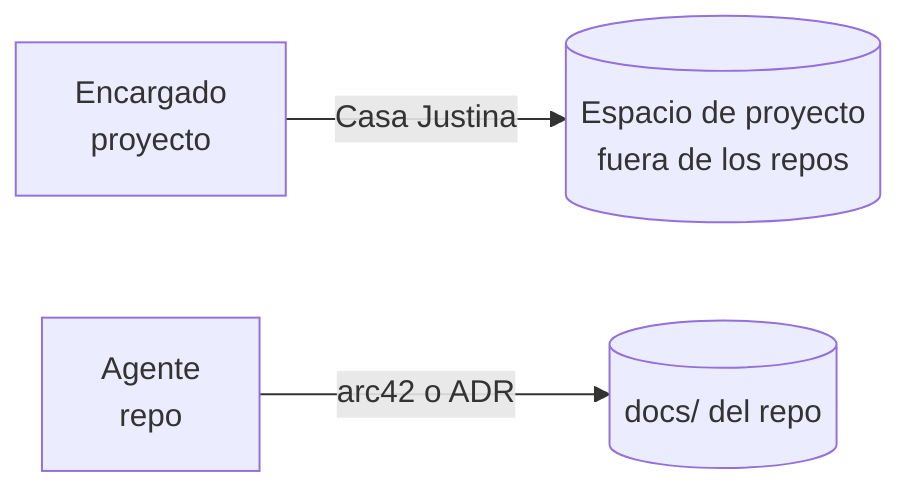

# Mapeo: documentación por nivel de la jerarquía

- **Estado:** explorando
- **Sub-problema de:** [jerarquía de roles](../research.md)

## Regla

El **estándar de documentación depende del nivel**, no de la preferencia del momento:

## Detalle

### Encargado → Casa Justina, fuera de los repos

- **Alcance:** el proyecto entero, que cruza varios repos.
- **Ubicación:** un espacio propio, **separado** de los repos de código (igual que
  `docs-organizacion` respecto de los repos de BoRR-Pizzeria).
- **Por qué Casa Justina:** a nivel proyecto se **explora**; se necesitan opciones,
  trade-offs y descartes (`research.md` + `analisis/` + `fuentes/`), no solo conclusiones.
- **Análogo humano:** un jefe de proyecto que mantiene el "por qué" transversal.

### Agente → arc42 o ADR, dentro del repo

- **Alcance:** un repositorio concreto.
- **Ubicación:** el `docs/` de **ese** repo.
- **Por qué el estándar del repo:** el Agente **respeta** lo que el repo ya definió. Si el
  repo es formal, **arc42** (12 secciones, vista completa); si es más liviano, **ADR**
  (decisiones puntuales append-only).
- **Regla:** el Agente **no** documenta a nivel proyecto; eso es del Encargado.

## Trade-off clave: ¿por qué no un único estándar para todo?

- **Descartado — un solo estándar (ej. arc42 en todos lados):** ahoga la exploración a
  nivel proyecto (arc42 asume arquitectura ya decidida) y es pesado para repos chicos.
- **Descartado — Casa Justina en todos lados:** a nivel repo lo que hace falta es lo
  **congelado** y verificable contra el código, no exploración perpetua.
- **Elegido — estándar por nivel:** cada nivel usa la herramienta que corresponde a su
  grado de incertidumbre. La graduación (Casa Justina → ADR) conecta ambos mundos.

## Abierto

- Mecanismo concreto de **graduación** de un hallazgo del Encargado a un ADR/arc42 del repo.
- Cómo descubre el Agente el estándar vigente de su repo (¿un archivo declarativo, tipo
  `engineering.yaml`, que diga `docs: arc42 | adr`?).
