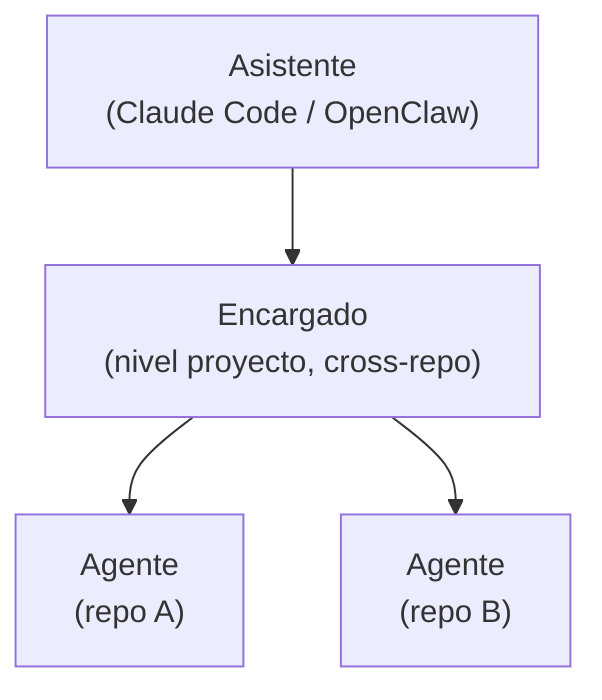

# Jerarquía de roles y gobernanza de documentación

- **Estado:** explorando (dirección preferida por el usuario, 2026-07-23)

## El tema

JAFNE organiza el trabajo en **tres niveles**. Lo interesante es que cada nivel no solo
tiene un alcance distinto, sino que **documenta con un estándar distinto**: la jerarquía
de roles y la de documentación son la misma.

## Los tres niveles

| Nivel | Alcance | Dónde documenta | Estándar |
|---|---|---|---|
| **Asistente** (Claude Code / OpenClaw) | Interfaz con el usuario; orquesta todo. | — | — |
| **Encargado** | El **proyecto** completo, que cruza varios repos. | **Por fuera** de los repos involucrados (un repo/espacio de proyecto aparte). | **Casa Justina** (evolutivo, exploratorio). |
| **Agente** | Un **repositorio** concreto. | Dentro de **ese** repo. | El estándar de ese repo: **arc42** (formal) o **ADR**. |

### Asistente
La capa que habla con el usuario y coordina. Corresponde a *Claude Code* / *OpenClaw* de
la arquitectura v0.2. **Abierto:** confirmar el nombre y si "Asistente" == OpenClaw o es
una capa por encima.

### Encargado
Piensa a nivel **proyecto**, no de un repo aislado. Su documentación vive **fuera** de los
repos de código (como `docs-organizacion` vive fuera de los repos de BoRR-Pizzeria) y usa
el estándar **Casa Justina**: exploratorio, con opciones y descartes. Es el dueño del
"por qué" transversal.

### Agente
Trabaja **dentro de un repo** y documenta según el **estándar de ese repo**: si el repo es
formal, **arc42**; si no, **ADR**. El agente respeta lo que ese repo ya define; no impone
un estándar externo.

## Por qué encaja con los tres modos de documentar

Esto refleja exactamente los [tres modos de `WORKFLOW.md`](../../WORKFLOW.md): **Casa
Justina** es el modo del Encargado (proyecto), **ADR/arc42** el de los Agentes (repo). El
propio JAFNE hace *dogfooding* de esta separación.

Detalle del mapeo en [`analisis/mapeo-documentacion-por-nivel.md`](./analisis/mapeo-documentacion-por-nivel.md).

## Ya decidido (graduó directo a ADR)

La cadena de escalación (Agente → Encargado → Asistente → Usuario), los dos modos de
comunicación (directo/delegado) y la palabra clave "Jafne" eran requisitos directos del
usuario, no alternativas para investigar — graduaron directo a
[ADR-0002](../../docs/adr/0002-jerarquia-de-roles-escalacion-y-modos-de-comunicacion.md)
sin pasar por este research.md (ver [ADR-0005](../../docs/adr/0005-cuando-investigar-vs-adr-directo.md)).

## Preguntas abiertas

- Nombre y límites exactos del **Asistente** (¿es OpenClaw o lo envuelve?).
- ¿Quién decide el estándar de un repo (arc42 vs ADR) y cómo lo descubre el Agente?
- Protocolo concreto de asignación de tareas Encargado → Agente (qué contexto se pasa,
  formato) — la cadena de escalación en sí ya está definida en ADR-0002.
- Relación con el *Engineering Coordinator* de v0.2: ¿el Encargado **es** el Coordinator?
- ¿Cómo "gradúa" un hallazgo del Encargado (Casa Justina) a un ADR dentro de un repo?
- ~~Memoria de estado/sesión del Encargado~~ — resuelta: el cierre de un Asunto documenta
  lo hablado ([ADR-0006](../../docs/adr/0006-asuntos-unidad-de-trabajo-y-ciclo-de-vida.md))
  y vive en `~/.jafne/asuntos/`
  ([ADR-0007](../../docs/adr/0007-jerarquia-de-directorios-de-jafne-implementado.md)).
