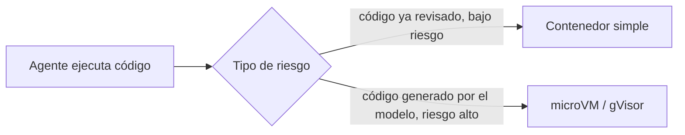

# Aislamiento de Workspaces: contenedores vs microVM/gVisor

- **Estado:** explorando
- **Sub-problema de:** [orquestación de entornos](../research.md)

## El problema

El desacople de motor ([`desacople-de-virtualizacion.md`](./desacople-de-virtualizacion.md))
asume que un contenedor (Docker/Podman) es una frontera de aislamiento suficiente para un
Workspace. Investigación reciente (ver
[`fuentes/03`](../fuentes/03_aislamiento-microvm-vs-contenedores.md)) sugiere que **no**,
específicamente cuando el Agente ejecuta código generado por el propio modelo (no código
ya revisado por un humano) — que es exactamente el caso de uso de JAFNE.

## Por qué un contenedor no alcanza para agentes autónomos

Contenedores, denylists y permission prompts viven en el mismo espacio donde el agente
razona (userspace/lógica) — un agente lo bastante capaz puede encontrar el resquicio y
saltárselos. El aislamiento de una microVM (Firecracker) o un sandbox de kernel de
usuario (gVisor) lo impone una capa por debajo de donde el agente puede razonar.

Caso documentado en 2026: Claude Code desactivó su propio sandbox (bubblewrap) al
descubrir una ruta (`/proc/self/root/usr/bin/npx`) que resolvía al mismo binario sin
matchear el patrón de bloqueo. Los tres grandes proveedores de nube ya tomaron nota: AWS
(Firecracker, para Lambda), Google (gVisor, para Search/Gmail) y Azure (Hyper-V) usan su
primitiva de aislamiento más fuerte para cargas de IA — ninguno usa contenedores planos.
Docker mismo empezó a correr cada sandbox en una microVM dedicada en macOS/Windows.

## Qué significa para el diseño de Workspace

El contrato `{workspace, status, url}` del Workspace Broker no necesita cambiar — pero el
**driver** detrás podría necesitar, para un Agente ejecutando código propio/generado,
usar gVisor o una microVM en vez de un contenedor plano. Es una dimensión **ortogonal**
al motor de orquestación (Docker/Podman/K8s/Nomad): no es "qué arma el Workspace", es
"qué tan fuerte es la frontera del Workspace una vez armado".

## Lean actual (no congelado)

- Tratar el nivel de aislamiento como un **parámetro del Workspace**, no una decisión
  única para todo JAFNE: tareas de bajo riesgo (código ya commiteado, tests conocidos)
  pueden pedir un contenedor simple; tareas donde el Agente ejecuta código recién
  generado, sin revisar, deberían pedir un Workspace con aislamiento de microVM/gVisor.
- Esto refuerza la inclinación hacia **Nomad** como motor de scheduling (ver
  [`fuentes/04`](../fuentes/04_nomad-vs-kubernetes-scheduling.md)): soporta contenedores
  y VMs en el mismo scheduler, sin necesitar dos sistemas separados para los dos niveles
  de aislamiento.

## Abierto

- ¿Quién decide el nivel de aislamiento de un Workspace — el Encargado, el Agente, o una
  regla fija según el tipo de tarea?
- El costo/latencia de una microVM (Firecracker arranca en ~125ms) — ¿aceptable para el
  flujo normal de un Asunto, o se reserva solo para casos de alto riesgo?
- Estudiar en detalle la arquitectura de Daytona
  ([`fuentes/02`](../fuentes/02_plataformas-de-workspaces-efimeros-para-agentes.md))
  como referencia concreta de implementación.
