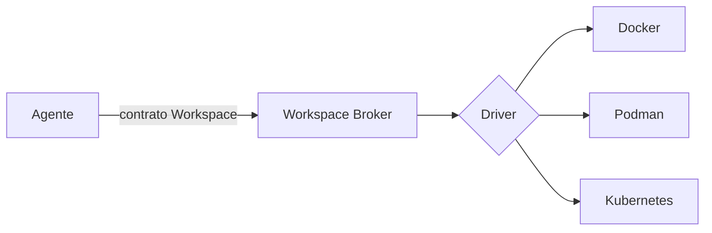

# Desacople de la virtualización

- **Estado:** explorando
- **Sub-problema de:** [orquestación de entornos](../research.md)

## Qué queremos

Que un agente pida "un entorno Flutter con Postgres" y **nunca** sepa si por detrás hay
Docker, Podman o Kubernetes. El motor debe poder cambiarse sin tocar a los agentes.

## Cómo se logra el desacople

El **Workspace Broker** expone un contrato estable (crear / destruir / suspender /
snapshot + `{ workspace, status, url }`). Detrás, un *driver* traduce ese contrato al
motor concreto. Los agentes dependen del contrato, no del motor.

## Opciones de motor por defecto

| Opción | A favor | En contra |
|---|---|---|
| **Docker + Compose** | Ubicuo, simple, lo que asume v0.2. | Daemon root, menos aislado. |
| **Podman** | Rootless, sin daemon, compatible con la CLI de Docker. | Menos maduro en Compose/algunas imágenes. |
| **Kubernetes** | Escala y scheduling multi-nodo de fábrica. | Pesado para tareas efímeras cortas; overkill al inicio. |

## Lean actual (no congelado)

- **Empezar con Docker/Compose** como driver por defecto (lo que ya asume v0.2), detrás
  del contrato del Broker.
- **Descartar K8s como default inicial**: su scheduling multi-nodo es deseable más
  adelante, pero es demasiado peso para la primera iteración de workspaces efímeros. Se
  reconsidera cuando el scheduling entre nodos (GPU/build/lab) sea el cuello de botella.
- Mantener **Podman** como segundo driver objetivo por el modelo rootless.

Cuando esto se cierre, gradúa a un ADR ("motor de virtualización por defecto de JAFNE").
