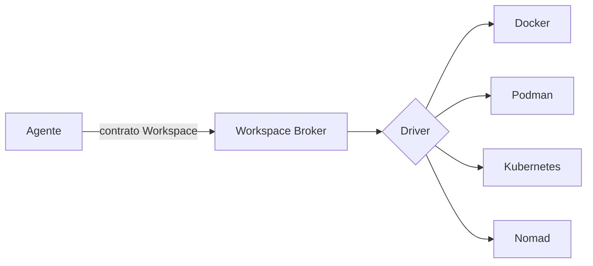

# Desacople de la virtualización

- **Estado:** explorando
- **Sub-problema de:** [orquestación de entornos](../research.md)

## Qué queremos

Que un agente pida "un entorno Flutter con Postgres" y **nunca** sepa si por detrás hay
Docker, Podman o Kubernetes. El motor debe poder cambiarse sin tocar a los agentes.

## Cómo se logra el desacople

El **Workspace Broker** expone un contrato estable (crear / destruir / suspender /
snapshot + `{ workspace, status, url }`). Detrás, un *driver* traduce ese contrato al
motor concreto. Los agentes dependen del contrato, no del motor.

## Opciones de motor por defecto

| Opción | A favor | En contra |
|---|---|---|
| **Docker + Compose** | Ubicuo, simple, lo que asume v0.2. | Daemon root, menos aislado. |
| **Podman** | Rootless, sin daemon, compatible con la CLI de Docker. | Menos maduro en Compose/algunas imágenes. |
| **Kubernetes** | Escala y scheduling multi-nodo de fábrica. | Pesado para tareas efímeras cortas; overkill al inicio; ~1h de setup y 5+ nodos para separar control plane. |
| **Nomad** (ver [`fuentes/04`](../fuentes/04_nomad-vs-kubernetes-scheduling.md)) | Setup en ~10 min con 3 nodos; GPU nativo (42% más throughput que K8s en un benchmark); soporta contenedores y VMs en el mismo scheduler. | Ecosistema más chico que Kubernetes; menos operadores/tooling de terceros. |

## Prior art directo

[Daytona, Coder y Gitpod](../fuentes/02_plataformas-de-workspaces-efimeros-para-agentes.md)
ya resuelven una versión de "pedir un entorno aislado para un agente sin importar la
infra de abajo" — vale estudiar su arquitectura concreta (Daytona en particular, por
estar hecho específicamente para agentes de IA) antes de terminar de cerrar el driver
por defecto de JAFNE.

## Redes y puertos: qué implica para la elección de motor (ADR-0011)

Con [ADR-0011](../../../docs/adr/0011-redes-y-puertos-de-workspace.md) ya decidido
(contenedores comiteados por repo, red aislada por proyecto, exposición vía ZeroTier),
aparece un detalle técnico a resolver: si cada **repo** trae su propio
Dockerfile/compose, por defecto Compose crea una red **por archivo compose** (o sea, por
repo) — no una red por **proyecto**. Para que los contenedores de BoRR se intercomuniquen
hace falta que el **Infrastructure Manager** una cada contenedor a una red de proyecto ya
existente al momento de armar el Workspace — el repo no declara esa red, solo su propio
servicio (mantiene "Agentes agnósticos de infraestructura").

### Docker vs. Podman, con esta necesidad puntual

| | Docker + Compose | Podman (+ podman-compose / Quadlet) |
|---|---|---|
| Red por proyecto (unir contenedores de repos distintos a una red externa ya creada) | Soportado (`networks: default: external: true`) | Soportado, mismo mecanismo |
| Publicar un puerto solo sobre la IP de la interfaz ZeroTier | `ports: "<ip_zerotier>:puerto:puerto"` | Igual, `--publish <ip>:puerto:puerto` |
| Aislamiento del daemon | Daemon corre como root — un escape de contenedor llega a root del host | Rootless, sin daemon — menor superficie si un Agente ejecuta código generado (ver [`aislamiento-de-workspaces.md`](./aislamiento-de-workspaces.md)) |
| Compatibilidad/ecosistema | El más usado, casi todo tutorial/imagen lo asume | Compatible con la mayoría de compose files; ecosistema más chico |
| Camino a Nomad más adelante | Soportado como driver | También soportado como driver ([`fuentes/04`](../fuentes/04_nomad-vs-kubernetes-scheduling.md)) |

### Decisión — graduó a ADR

**Podman** es el motor de contenedores por defecto — ver
[ADR-0012](../../../docs/adr/0012-motor-de-contenedores-podman.md). Rootless por
defecto reduce el radio de daño si un Agente ejecuta código generado dentro de un
Workspace (mismo riesgo que [`aislamiento-de-workspaces.md`](./aislamiento-de-workspaces.md)),
sin daemon corriendo todo el tiempo en la máquina servidor, y sin perder compatibilidad
con Compose ni el camino futuro a Nomad.

## Lo que sigue abierto (no congelado)

- **Scheduling multi-nodo (GPU/build/lab):** lean hacia Nomad sobre Kubernetes — ver
  [`fuentes/04`](../fuentes/04_nomad-vs-kubernetes-scheduling.md) — pero todavía sin
  confirmar con el usuario. Nomad puede correr Podman como driver, así que no entra en
  conflicto con [ADR-0012](../../../docs/adr/0012-motor-de-contenedores-podman.md).
- **Nivel de aislamiento** (contenedor simple vs microVM/gVisor) para Agentes
  ejecutando código recién generado — ver
  [`aislamiento-de-workspaces.md`](./aislamiento-de-workspaces.md). Es una dimensión
  separada de "qué motor de contenedores" y sigue sin resolverse.
