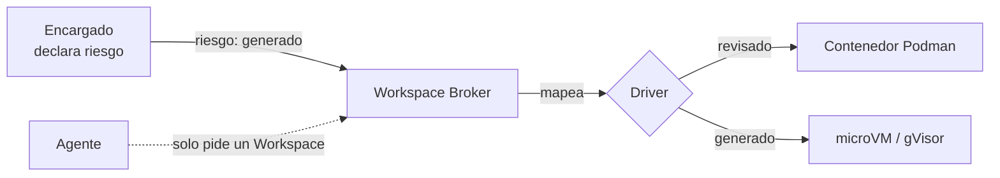

# Quién decide el nivel de aislamiento de un Workspace

- **Estado:** **graduado a [ADR-0027](../../../docs/adr/0027-clase-de-riesgo-declarada-por-el-encargado.md)** (2026-08-18)
- **Sub-problema de:** [orquestación de entornos](../research.md)
- **Continúa:** [`aislamiento-de-workspaces.md`](./aislamiento-de-workspaces.md), que dejó
  el nivel de aislamiento como *parámetro* del Workspace pero sin definir quién lo fija.

## El problema

[`aislamiento-de-workspaces.md`](./aislamiento-de-workspaces.md) concluyó que un
contenedor plano no alcanza cuando un Agente ejecuta código recién generado, y que el
nivel de aislamiento debería ser un parámetro por tarea, no una decisión única para todo
JAFNE. Falta responder **quién completa ese parámetro** — y la respuesta no es libre:
tiene que convivir con el principio 1 de la arquitectura, *agentes agnósticos de
infraestructura*.

## Opciones

| Opción | Cómo funciona | Por qué sí / por qué no |
|---|---|---|
| **A. Lo pide el Agente** | El Agente pide "quiero microVM" al Workspace Broker | **Descartada.** Rompe el principio 1: el Agente tendría que conocer microVM/gVisor, que es exactamente la tecnología que el diseño le oculta. Además le pide a quien ejecuta el código no confiable que se autoevalúe el riesgo |
| **B. Lo decide el Encargado, en términos de infraestructura** | El Encargado pide "microVM para esta tarea" | Mejora: el Encargado sí puede juzgar el riesgo. Pero lo obliga a hablar de tecnología de virtualización, que es justo el acople que [ADR-0012](../../../docs/adr/0012-motor-de-contenedores-podman.md) mantiene detrás del contrato del Broker. Si mañana entra gVisor o Nomad, hay que reeducar a todos los Encargados |
| **C. Regla fija por tipo de tarea** | Una tabla en Infraestructura: "tests → contenedor, build → contenedor, ejecutar código nuevo → microVM" | Determinista y auditable, pero la tabla tiene que enumerar tipos de tarea por adelantado, y una tarea que no encaja cae en el caso por defecto sin que nadie lo note |
| **D. El Encargado declara la *clase de riesgo*; Infraestructura mapea riesgo → aislamiento** | El pedido de Workspace lleva un campo `riesgo`; el Broker traduce | **Lean.** Ver abajo |

## Por qué D

- **Mantiene el principio 1 intacto.** El Encargado habla de *riesgo* (algo que entiende:
  ¿este código lo revisó un humano o lo acaba de escribir un modelo?), no de *tecnología*.
  Traducir riesgo → microVM/gVisor/contenedor queda del lado de Infraestructura, que es
  donde ya vive la elección de motor (ADR-0012).
- **Es simétrico con una decisión que JAFNE ya tomó.** El Encargado ya decide,
  tarea por tarea, qué cerebro y qué esfuerzo asignarle a un Agente
  ([ADR-0003](../../../docs/adr/0003-cerebro-por-rol-y-agnosticismo-de-proveedor.md)).
  Declarar la clase de riesgo es el mismo tipo de juicio, sobre el otro plano.
- **La política de "más tokens antes que rehacer" tiene su análogo exacto acá.** ADR-0003
  eligió gastar de más antes que arriesgar re-trabajo; el equivalente en infraestructura es
  **aislar de más antes que arriesgar un escape**. Eso fija el default: ante la duda, la
  clase más estricta.
- **El costo de equivocarse hacia arriba es bajo.** Firecracker arranca en ~125 ms
  ([`fuentes/03`](../fuentes/03_aislamiento-microvm-vs-contenedores.md)) — el precio de
  sobre-aislar no es latencia, es complejidad operativa. Eso cambia la pregunta abierta
  que había dejado el análisis anterior: no es "¿nos podemos permitir microVM?", es
  "¿podemos operar dos drivers?".

## Forma concreta que tendría

Dos clases, no cinco — un catálogo chico se puede razonar y auditar:

- **`revisado`** — el código ya pasó por revisión humana o está commiteado en el repo:
  correr tests conocidos, buildear, levantar servicios del proyecto.
- **`generado`** — el Agente va a ejecutar código que acaba de escribir un modelo, sin
  revisar. **Es el default.**

El campo viaja en el **pedido de Workspace**, no en `engineering.yaml`: el riesgo es una
propiedad de *la tarea*, no del repositorio. El mismo repo tiene tareas de las dos clases.

## Abierto

- ¿Dos clases alcanzan, o hace falta una tercera para "código de terceros / dependencias
  nuevas"?
- ¿Quién audita que el Encargado no marque todo como `revisado` para ir más rápido? Se
  cruza con la cadena de aprobación de capacidades
  ([ADR-0004](../../../docs/adr/0004-capacidades-por-repositorio.md)).
- Operar dos drivers (Podman + microVM/gVisor) es la pregunta de costo real. Nomad los
  agenda a los dos con un solo scheduler
  ([`fuentes/04`](../fuentes/04_nomad-vs-kubernetes-scheduling.md)), lo cual refuerza el
  lean hacia Nomad — pero eso sigue sin confirmarse.
- Falta estudiar Daytona como referencia de implementación
  ([`fuentes/02`](../fuentes/02_plataformas-de-workspaces-efimeros-para-agentes.md)),
  pendiente heredado del análisis anterior.
