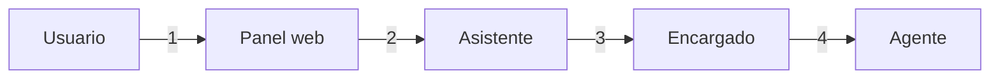

# Los cuatro hops de comunicación de JAFNE (y por qué no son el mismo problema)

- **Estado:** explorando (2026-08-11)
- **Sub-problema de:** [protocolo de asignación de tareas](../research.md)

## El problema

La investigación arrancó preguntando "¿qué protocolo usa JAFNE?" — en singular. Con el
panel web congelado como requisito
([ADR-0013](../../../docs/adr/0013-panel-web-como-dashboard-visual.md)) queda claro que
**no hay un protocolo, hay cuatro hops distintos**, y meterlos todos en la misma decisión
elegiría mal para al menos dos.

## Los hops, y qué pide cada uno

| # | Hop | ¿Hay un humano esperando? | Qué viaja | Requisito dominante |
|---|---|---|---|---|
| 1 | Usuario ↔ Panel | Sí | Texto, estado, eventos | Streaming al navegador. **Ya resuelto**: HTTP + SSE ([ADR-0015](../../../docs/adr/0015-stack-inicial-de-implementacion.md)) |
| 2 | Panel ↔ Asistente / Encargado | Sí | Conversación viva | **Adjuntarse a una sesión** que ya existe y sigue existiendo cuando el navegador se cierra |
| 3 | Asistente ↔ Encargado | Depende del modo | Conversación (directo) o tarea + resumen (delegado) | Relay pass-through **y** relay con resumen ([ADR-0002](../../../docs/adr/0002-jerarquia-de-roles-escalacion-y-modos-de-comunicacion.md)) |
| 4 | Encargado ↔ Agente | No | Una tarea y su resultado | Ciclo de vida de tarea, reintentos, reporte de avance |

**Los hops 1–3 son conversación en streaming; el hop 4 es delegación de trabajo.** A2A,
CrewAI y MCP-handoff ([comparación](./comparacion-de-protocolos.md)) compiten por el hop
4. Ninguno de los tres resuelve el hop 2 — no fueron diseñados para eso.

## El hop 2 es el que no tiene respuesta

El panel no le habla a un modelo: le habla a un **proceso que está corriendo un agente de
código** (Claude Code, OpenClaw — [ADR-0010](../../../docs/adr/0010-proveedores-iniciales-asistente.md)),
con su propio contexto, sus herramientas y su sesión. Y ese proceso tiene que sobrevivir
al navegador, porque un Asunto persiste mientras el Usuario hace otra cosa
([ADR-0006](../../../docs/adr/0006-asuntos-unidad-de-trabajo-y-ciclo-de-vida.md)).

La pregunta real del hop 2 es: **¿quién es dueño del proceso del agente?**

| Opción | Cómo funciona | A favor | En contra |
|---|---|---|---|
| **A. JAFNE dueño del proceso** | El Workspace lanza al agente como subproceso y JAFNE multiplexa su E/S (estilo pty/tmux broker) | Funciona con cualquier proveedor que tenga CLI — máximo agnosticismo | Se parsea salida pensada para una terminal; frágil ante cambios de formato; el estado estructurado (qué herramienta corrió) se pierde |
| **B. El proveedor expone sesiones** | El proveedor ofrece un modo servidor/SDK con sesiones adjuntables; el panel se conecta a esa sesión | Eventos estructurados, no texto de terminal; reconexión y multi-cliente resueltos por el proveedor | Depende de que cada proveedor lo ofrezca, y no todos lo hacen igual |
| **C. JAFNE reimplementa el bucle de agente** | El panel llama al modelo directo; JAFNE es el harness | Control total del formato | Contradice el espíritu de [ADR-0003](../../../docs/adr/0003-cerebro-por-rol-y-agnosticismo-de-proveedor.md): ser agnóstico es *configurar* el cerebro, no reconstruir el agente. Tirar a la basura Claude Code/OpenClaw para reescribirlos es el camino más caro posible |

## Lean actual (no decidido)

- **B donde el proveedor lo ofrezca, A como fallback.** Es la misma forma que JAFNE ya usa
  para todo lo demás: un contrato neutral arriba, un adaptador por proveedor abajo.
- **Esto reencuadra el pendiente `adaptador-agents`.** El adaptador de
  [ADR-0003](../../../docs/adr/0003-cerebro-por-rol-y-agnosticismo-de-proveedor.md) no es
  solo "traducir `.agents/` a `.claude/skills/`": también es **"cómo me adjunto a una
  sesión de este proveedor"**. Son la misma pieza y hoy están anotadas como dos pendientes
  distintos.
- **El hop 2 y el hop 3 colapsan en el panel.** "Entrar a un proyecto"
  ([ADR-0013](../../../docs/adr/0013-panel-web-como-dashboard-visual.md)) es el panel
  adjuntándose a la sesión del Encargado en vez de a la del Asistente — el mismo
  mecanismo, distinto destino. Un solo diseño cubre los dos.
- **El hop 4 puede decidirse aparte y después.** No bloquea al panel: se puede tener chat
  con el Encargado antes de congelar cómo el Encargado le pasa tareas a un Agente.

## Abierto

- ¿Claude Code y la familia OpenAI ofrecen hoy un modo sesión adjuntable, y con qué forma?
  Es la pregunta que decide si B es viable o si A es el piso real. **Sin relevar todavía.**
- Si el proceso del agente vive dentro del Workspace del Asunto (ADR-0006), ¿el panel
  atraviesa la frontera de red del proyecto para adjuntarse
  ([ADR-0011](../../../docs/adr/0011-redes-y-puertos-de-workspace.md))? El aislamiento
  entre proyectos dice que un proyecto no ve a otro — pero el panel los ve a todos.
- ¿Qué pasa con **dos clientes adjuntos a la misma sesión** (el panel y una terminal)?
  Se cruza con la pregunta abierta de ADR-0002 sobre múltiples Encargados activos.
